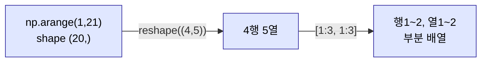
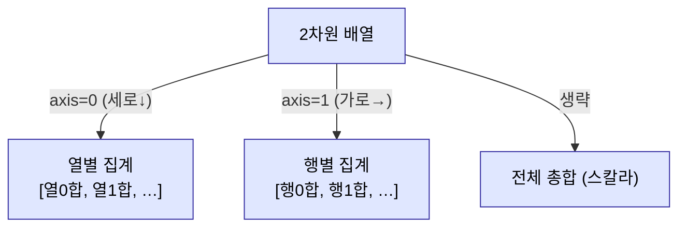

# 2026-05-26 NumPy 배열·연산·집계 복습 자료

> 수업 필기(`numpy_exam1.py`, `numpy_aristhmatic.py`, `numpy_innerProduct.py`)를 주제별로 재구성하고 설명을 덧붙였습니다.

---

## 0. 왜 NumPy 인가

- 1·2·3차원 등 **다차원 배열** 데이터를 생성·연산할 필요가 생긴다.
- 파이썬 `list` 의 `+` 는 **이어붙이기**지만, NumPy 배열의 `+` 는 **행렬(원소별) 연산**.
- 관례적 별칭: `import numpy as np`.
- NumPy 는 오로지 **수치**만 다룬다(이후 배울 pandas 는 수치+라벨 지원).

---

## 1. 배열 생성과 형태 — `array`, `ndim`, `shape` (`numpy_exam1.py`)

### 1-1. 리스트로 배열 만들기

```python
import numpy as np

arr1 = np.array([[5, 6, 7, 8], [15, 16, 17, 18]])
arr1.ndim    # 2   — 차원 수
arr1.shape   # (2, 4) — 2행 4열
```

### 1-2. shape 읽는 법 — 안쪽부터 묶음 단위

```python
np.array([[5], [6], [7], [8]])                 # shape (4, 1)
np.array([[[5], [6], [7], [8]]])               # shape (1, 4, 1)  ← (4,1)을 1개 묶음
np.array([[[5],[6],[7],[8]], [[9],[10],[11],[12]]])  # shape (2, 4, 1) ← (4,1)을 2개 묶음
```

- `shape` 는 **(바깥 묶음 … 안쪽)** 순서. 3차원에서 `shape[0]` 은 흔히 **채널 수**로 본다.

| 속성/함수 | 반환 |
|---|---|
| `arr.ndim` | 차원 수 |
| `arr.shape` | 형태 튜플 `(행, 열, …)` |

### 1-3. 범위·난수·정형 배열 생성

```python
np.arange(1, 13)                     # 1차원 선형 수열 [1..12], shape (12,)
np.arange(1, 13).reshape((3, 4))     # 3행 4열로 재배열 — 크기는 튜플로
np.random.randint(1, 100, (4, 5))    # 1~99 정수 난수, 4행 5열
np.zeros((13, 13))                   # 0으로 채운 배열
np.ones((13, 13))                    # 1로 채운 배열
```

- `reshape` 의 크기 인자는 **튜플** `(3, 4)`.
- `arange` 의 전체 원소 수와 `reshape` 크기의 곱이 맞아야 한다(12 = 3×4).

### 1-4. 인덱싱 & 슬라이싱 — 항상 (행, 열)

```python
arr8 = np.arange(1, 21).reshape((4, 5))
arr8[1][2]        # 1행 2열 (둘 다 0부터) — 체인 인덱싱
arr8[1:3, 1:3]    # [행 슬라이싱, 열 슬라이싱] — 한 대괄호 안에 콤마로
arr8[:3, :3]      # 0~2행, 0~2열
arr8[1:, 3:]      # 1행 이후, 3열 이후
```

- NumPy 슬라이싱은 **`[행, 열]`** 한 쌍으로. `arr8[1:2][1:2]` 처럼 따로 끊으면 의도와 다르게 동작.



---

## 2. 산술 연산 & 브로드캐스트 (`numpy_aristhmatic.py`)

### 2-1. 원소별(행렬) 연산 — shape 일치 필요

```python
np.array([5, 6, 7]) + np.array([3, 4, 5])      # [8, 10, 12] — 위치별 합
np.array([5, 6, 7]) + np.array([3, 4, 5, 2])   # ⚠️ 에러 — shape 불일치
np.array([[5, 6], [3, 7]]) + np.array([[3, 4], [5, 2]])  # 2차원도 위치별
```

- 리스트와 달리 `+` 는 이어붙이기가 아니라 **같은 위치끼리 연산**. 그래서 **shape 가 맞아야** 한다.

### 2-2. 브로드캐스트 — 스칼라 전파

```python
np.array([3, 4, 5]) + 3     # [6, 7, 8] — 3이 내부적으로 [3,3,3]으로 전파
```

- shape 이 안 맞아도 **스칼라**는 배열 전체로 **전파(broadcast)** 되어 연산.

### 2-3. 등간격 데이터 & 시각화 맛보기

```python
import matplotlib.pyplot as plt

np.linspace(1, 10, 5)       # [1, 3.25, 5.5, 7.75, 10] — 시작~끝을 N구간(기본 50)
arr = np.array([1, 3, 6, 10, 15])
# plt.plot(arr); plt.show()  # 배열을 그래프로 렌더링 후 표시
```

- `np.arange` 는 **간격(step)** 기준, `np.linspace` 는 **개수(num)** 기준으로 등간격 생성.

---

## 3. 행렬곱·비교·집계통계 (`numpy_innerProduct.py`)

### 3-1. 행렬곱 — `np.dot`

```python
x = np.array([[2, 3], [1, 2]])
y = np.array([[1, 2], [2, 3]])
np.dot(x, y)        # 행렬 내적(곱). 원소별 곱(*)과 다름
```

### 3-2. 비교 연산 → 불린 배열

```python
arr1 = np.random.randint(1, 13, (3, 4))
arr1 > 6            # 각 원소를 비교해 True/False 불린 배열 반환
```

- 비교 결과가 **불린 배열** → 이후 조건 색인(불린 인덱싱)의 기초.

### 3-3. 집계통계 & `axis` ★핵심★

```python
arr2 = np.arange(1, 50, 2).reshape((5, 5))

arr2.sum()           # 전체 총합 (axis 생략 시)
arr2.sum(axis=0)     # 행축 — 세로로 합산(열별 합)
arr2.sum(axis=1)     # 열축 — 가로로 합산(행별 합)
arr2.mean(axis=0)    # 열별 평균
arr2.max(axis=1)     # 행별 최댓값
arr2.min(axis=1)
np.sum(arr2)         # 함수형 — 대상을 인자로 (arr2.sum()과 동일)
```

| `axis` | 의미 | 방향 |
|---|---|---|
| `axis=0` | 행축 연산 | 아래로 내려가며(세로) → **열별** 결과 |
| `axis=1` | 열축 연산 | 옆으로 가며(가로) → **행별** 결과 |
| 생략 | 전체 | 모든 원소 총합 |

- 두 가지 호출 방식: **메서드형** `arr2.sum()` vs **함수형** `np.sum(arr2)`. 함수형은 대상을 인자로 준다.



### 3-4. NumPy → pandas 로 넘기기 (예고)

```python
import pandas as pd

df = pd.DataFrame(arr2, columns=list('abcde'))  # 넘파이 배열로 DataFrame 생성
df['d'][1]      # 라벨(컬럼) 기반 접근 — pandas 라서 가능
df.iloc[1, 2]   # 수치 인덱스 접근 (1행 2열)
```

- NumPy 는 **수치 인덱스만**, pandas 는 **라벨 + 수치** 모두 지원.
- 배열을 빨리 엑셀로 저장하고 싶으면 `pd.DataFrame(배열).to_excel(...)`.

---

## 4. 오늘의 핵심 한눈에

| 주제 | 핵심 키워드 |
|---|---|
| 별칭 | `import numpy as np` |
| 배열 생성 | `np.array(리스트)`, `np.arange`, `np.linspace`, `np.zeros`, `np.ones`, `np.random.randint` |
| 형태 | `arr.ndim`(차원), `arr.shape`(형태 튜플) |
| 재배열 | `reshape((행, 열))` — 크기는 **튜플** |
| 인덱싱 | `arr[행, 열]`, 슬라이싱 `arr[1:3, 1:3]` |
| 산술 | 원소별 연산 — **shape 일치 필요** |
| 브로드캐스트 | 스칼라가 배열 전체로 전파 |
| 행렬곱 | `np.dot(x, y)` |
| 비교 | `arr > 6` → 불린 배열 |
| 집계 | `sum/mean/max/min` + **`axis=0`(열별) / `axis=1`(행별)** |
| 호출 방식 | 메서드형 `arr.sum()` vs 함수형 `np.sum(arr)` |
| pandas 연계 | `pd.DataFrame(배열)`, `iloc`/라벨 접근 |

> 다음 단계: 불린 인덱싱으로 조건 추출, `np.where`, 정렬(`np.sort`/`argsort`), 축 변환(`transpose`), pandas 본격 학습(Series/DataFrame).
