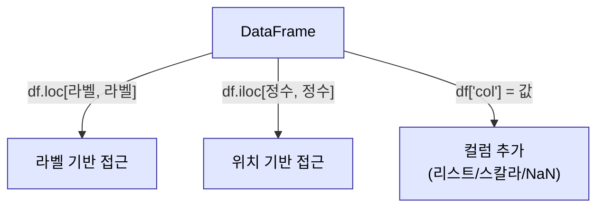

# 2026-05-27 pandas DataFrame·전처리·시각화 복습 자료

> 수업 필기(`pandas_exam1.py` ~ `pandas_exam5.py`, `pandas_exel.py`, `pandas_exel_2.py`, `pandas_test.py`, `판다스_넘파이_출력옵션제어.py`, `matplotlib_hangul_font_setting.py`)를 주제별로 재구성하고 설명을 덧붙였습니다.

---

## 0. 큰 그림 — pandas 란

- **pandas** = NumPy 의 상위 라이브러리, **데이터 분석에 특화**.
- 두 가지 핵심 객체:
  - **Series** — 1차원 배열 형태 (DataFrame 의 한 컬럼).
  - **DataFrame** — 2차원 배열 형태 (표).
- NumPy 는 **수치 인덱스만**, pandas 는 **수치 + 라벨(문자열) 인덱스** 모두 지원.
- 관례적 별칭: `import pandas as pd`, `import numpy as np`.

---

## 1. DataFrame 생성 (`pandas_exam1.py`)

### 1-1. 세 가지 생성 방법

```python
# ① 딕셔너리 — key가 컬럼명
mydf = pd.DataFrame({"kor": [50, 60, 70], "eng": [80, 90, 77]}, index=list('abc'))

# ② 리스트(2차원) — columns/index 별도 지정
myDf = pd.DataFrame([[60, 80, 70], [90, 50, 85], [66, 77, 88]],
                    columns=['국어', '영어', '수학'], index=['a', 'b', 'c'])

# ③ NumPy 배열
myDf = pd.DataFrame(np.arange(10, 25).reshape((5, 3)),
                    columns=['one', 'two', 'three'], index=list('abcde'))
```

- **딕셔너리**로 만들면 key 가 자동으로 컬럼이 된다.
- `index` 미지정 시 **자동 정수 인덱스**(0,1,2…) 생성.

### 1-2. 주요 속성 & 컬럼 일괄 변경

```python
mydf.columns         # 컬럼 인덱스 반환 (dtype='object' = 문자열)
mydf.index           # 행 인덱스 반환
mydf.values          # 내용물 → NumPy 배열로 반환
mydf['kor']          # 한 컬럼 선택 → Series(1차원)
mydf.columns = ["국어", "영어"]   # 컬럼명 일괄 교체
```

- 한 컬럼을 고르면 **Series**(1차원)가 된다.
- 컬럼명은 하나씩 인덱싱으로 못 바꾼다 → `df.columns = [...]` 로 **통째로 교체**.
- 인덱스 두 종류: **명시적 인덱스**(눈에 보이는 라벨) vs **암묵적 인덱스**(수치).

---

## 2. 선택 접근 — `loc` vs `iloc` (`pandas_exam2.py`)

```python
myDf.loc['c', 'two']    # 라벨(label location)로 접근
myDf.iloc[2, 1]         # 정수(integer location)로 접근
myDf['b', 'two']        # ⚠️ 에러 — 위치 접근엔 loc/iloc 필요
```

| 접근자 | 기준 | 비고 |
|---|---|---|
| `df.loc[행, 열]` | **라벨** | 불린 배열 색인 지원 |
| `df.iloc[행, 열]` | **정수 위치** | 0부터, 펜스(cherry-pick) 인덱싱 가능 |

- 라벨이 없어 수치처럼 보여도 pandas 는 그것을 **명시적 라벨**로 본다 → `df.loc[2, 'two']` 가능. 하지만 헷갈리니 **수치는 `iloc` 로 통일**.

### 2-1. 컬럼/행 추가 & 결측치

```python
myDf['four'] = list(range(5))   # 새 컬럼 — 길이 맞는 리스트
myDf['four'] = 0                # 스칼라 → 브로드캐스트
myDf['four'] = np.nan           # 결측치 NaN(Not a Number) = 엑셀의 빈칸

myDf.loc[5] = np.nan            # 새 행 추가 — 라벨이 없으니 loc(명시적 인덱스)로
```

- 새 컬럼/행 추가는 마치 딕셔너리에 key 추가하듯. **항상 `index`, `columns`, `dtype` 을 확인**하는 습관.



---

## 3. 슬라이싱과 view/copy 함정 (`pandas_exam3.py`)

```python
dictData = {'Hong': [90,80,70,50], 'Kim': [85,95,65,55],
            'Park': [88,93,75,72], 'Lee': [55,66,77,92]}
df = pd.DataFrame(dictData, index=['kor', 'eng', 'math', 'music'])

# 라벨 슬라이싱 — stop 포함!
df.loc['eng':'math', 'Kim':'Park']   # eng, math / Kim, Park 모두 포함
# 정수 슬라이싱 — stop-1까지
df.iloc[1:3, 1:3]                    # 1,2행 / 1,2열

subsetDf = df.iloc[1:3, 1:3]
subsetDf.iloc[0:1] = 99
print(df)   # ⚠️ 원본도 바뀜! — view 관계
```

- ★ **라벨 슬라이싱은 stop 포함**, **정수 슬라이싱은 stop-1까지**.
- 슬라이싱 결과는 NumPy 처럼 **view(원본 공유)** 일 수 있다 → 사본만 가공하려면 **`.copy()`** 로 완전 복제.

---

## 4. 불린 색인 & 다중 컬럼 선택 (`pandas_exam4.py`)

```python
df['Kim'] >= 70                 # 불린 배열(Series)
df.loc[df['Kim'] >= 70, 'Kim':'Park'].copy()   # True 행만 추출 (불린색인은 loc만!)

df[['Hong', 'Park']]            # 여러 컬럼 선택 — 반드시 리스트로 감싸기
```

- **불린 색인은 `loc` 만 지원**. True 항목만 자동 추출.
- **여러 컬럼**을 한 번에 고르려면 `df[['a', 'b']]` — 대괄호 두 겹(리스트).

---

## 5. 삭제·시각화 (`pandas_exam5.py`)

```python
del df['Park']                              # 컬럼 1개 삭제 (키워드 del)
df.drop(['Hong', 'Park'], axis=1, inplace=True)   # 여러 컬럼 (axis=1)
df.drop(['eng', 'music'], axis=0, inplace=True)   # 행 (axis=0, 기본값)

df.index = ['국어', '영어', '수학', '음악', '과학']   # 인덱스 라벨 교체

df.plot.bar()       # pandas에 내장된 matplotlib 막대그래프
plt.show()
```

| 방법 | 대상 | 비고 |
|---|---|---|
| `del df['col']` | 컬럼 1개 | 키워드, 한 번에 하나 |
| `df.drop(목록, axis=1)` | 여러 컬럼 | `axis=1`=열 |
| `df.drop(목록, axis=0)` | 행 | `axis=0`(기본) |

- `drop` 은 기본적으로 **사본** 반환 → 원본에 반영하려면 **`inplace=True`** (DataFrame 은 메모리를 많이 써서 필수가 되는 순간이 온다).
- `df.plot.bar()` — pandas 가 matplotlib `plot` 기능을 흡수. `plt.show()` 로 표시.

---

## 6. 한글 폰트 설정 (`matplotlib_hangul_font_setting.py`)

```python
import platform
import matplotlib.pyplot as plt
from matplotlib import font_manager, rc

plt.rcParams['axes.unicode_minus'] = False   # 음수 부호 깨짐 방지

if platform.system() == 'Darwin':            # macOS
    rc('font', family='AppleGothic')
elif platform.system() == 'Windows':         # Windows
    path = "C:/Windows/Fonts/malgun.ttf"
    font_name = font_manager.FontProperties(fname=path).get_name()
    rc('font', family=font_name)
else:
    print("Unknown system...")
```

- matplotlib 는 기본 폰트에 **한글이 없어 □□□ 로 깨진다** → OS별 한글 폰트 지정 필수.
- Windows 는 맑은 고딕(`malgun.ttf`), macOS 는 `AppleGothic`.
- `axes.unicode_minus = False` — 마이너스 기호 깨짐도 함께 방지.

---

## 7. 엑셀/CSV 읽기 & 전처리 (`pandas_exel.py`)

### 7-1. 읽기 & 정보 확인

```python
popdf = pd.read_excel('src/20260527/population_in_seoul.xls')

popdf.info()          # 컬럼·타입·결측 요약 (반환값 없음 → print(popdf.info()) ✕)
popdf.head(10)        # 앞 n행(기본 5)
popdf.tail()          # 뒤 n행
popdf.sample(5)       # 무작위 n행
subset = popdf.head().copy()   # view 끊기
```

- ⚠️ `info()` 는 화면 출력만 하고 **반환값이 없다** → `print(popdf.info())` 는 `None` 이 따라붙음. 그냥 `popdf.info()`.

### 7-2. 결측치 처리 흐름

```python
popdf.drop([0], axis=0, inplace=True)        # '합계' 행 제거
popdf.drop(['고령자'], axis=1, inplace=True)  # 불필요 컬럼 제거

popdf['남자'].isnull()                        # NaN이면 True 불린 배열
popdf.dropna(axis=0, how='any', inplace=True) # 결측 행 삭제

popdf.reset_index(inplace=True, drop=True)    # 인덱스 초기화 (drop=True: 기존 인덱스 버림)
popdf.set_index('자치구', inplace=True)        # 특정 컬럼을 인덱스로
```

| 메서드 | 동작 |
|---|---|
| `isna()` / `isnull()` | NaN 위치 → 불린 |
| `dropna(how='any')` | 결측 **하나라도** 있으면 행 삭제 |
| `dropna(how='all')` | **모두** NaN일 때만 삭제 |
| `reset_index(drop=True)` | 인덱스 0부터 재부여, 기존 인덱스 버림 |
| `set_index('컬럼')` | 컬럼을 인덱스로 승격 |

- 결측치 삭제 후에는 인덱스가 듬성듬성해지므로 **`reset_index`** 로 정리하는 습관.


---

## 8. CSV 읽기 & 조건 필터 (`pandas_exel_2.py`)

```python
my_df = pd.read_csv('src/20260527/서울특별시_지하철 승하차 승객수.csv', encoding='CP949')

my_df['호선_명칭'].unique()    # 컬럼의 고유값 목록

# isin — 목록에 포함되면 True
subset = my_df.loc[my_df['호선_명칭'].isin(['3호선', '7호선', '9호선', '9호선(연장)']), :]
subset.set_index(['기준_날짜'], inplace=True, drop=True)
```

- 한글 CSV 는 **`encoding='CP949'`**(또는 `euc-kr`) 가 필요한 경우가 많다.
- `unique()` — 어떤 값들이 있는지 먼저 파악.
- **`isin([목록])`** — 여러 값 중 하나라도 일치하면 True → 여러 카테고리를 한 번에 필터. 여러 `==` 를 `concat` 하는 것보다 깔끔.

---

## 9. 시계열 인덱스 (`pandas_test.py`)

```python
my_df['기준_날짜'] = pd.to_datetime(my_df['기준_날짜'])  # 문자열 → 시계열 타입
my_df.set_index('기준_날짜', inplace=True, drop=True)
my_df.loc['2024-8-18']        # 날짜 라벨로 접근

idx = pd.date_range('2025.12.25', periods=30, freq='D')  # 시계열 범위 생성
index_df = pd.DataFrame(np.arange(30, 60), columns=['데이터'], index=idx)
index_df['2025']              # 연 단위 부분 선택(partial string indexing)
```

- `pd.to_datetime()` — 문자열 컬럼을 **시계열(datetime)** 타입으로 변환.
- 날짜를 인덱스로 두면 `loc['2024-8-18']`, `df['2025']` 처럼 **연/월 단위 부분 선택**이 된다.
- `pd.date_range(시작, periods=N, freq='D')` — 일(`D`)·월(`M`) 등 주기로 날짜 범위 생성.

---

## 10. 출력 옵션 제어 (`판다스_넘파이_출력옵션제어.py`)

```python
pd.set_option('display.max_rows', 1000)
pd.set_option('display.max_columns', 500)
pd.set_option('display.width', 1000)
pd.set_option('max_colwidth', 1000)
pd.set_option('display.float_format', '{:.3f}'.format)  # 소수점 3자리

np.set_printoptions(precision=3)        # 소수점 3자리
np.set_printoptions(threshold=np.inf)   # 생략 없이 전부 출력
np.set_printoptions(suppress=True)      # 지수표기(과학적표기) 억제

# 예쁜 표 출력
from prettytable import PrettyTable     # pip install prettytable
def print_df(df):
    table = PrettyTable([''] + list(df.columns))
    for row in df.itertuples():
        table.add_row(row)
    print(table)
```

- 큰 DataFrame 이 `...` 로 잘릴 때 **`pd.set_option`** 으로 행/열/너비 한도를 늘린다.
- `np.set_printoptions(suppress=True)` — `1e-05` 같은 지수표기 억제.
- `PrettyTable` + `df.itertuples()` 로 표를 보기 좋게 출력(별도 설치 필요).

---

## 11. 오늘의 핵심 한눈에

| 주제 | 핵심 키워드 |
|---|---|
| 객체 | **Series**(1차원), **DataFrame**(2차원) |
| 생성 | `pd.DataFrame(dict / list / np배열, columns=, index=)` |
| 속성 | `.columns`, `.index`, `.values`, `.dtypes` |
| 접근 | **`loc`(라벨) / `iloc`(정수)**, 수치는 iloc 통일 |
| 슬라이싱 | 라벨=**stop 포함**, 정수=stop-1, view면 **`.copy()`** |
| 불린 색인 | `df.loc[조건, :]` (loc만!), `isin([목록])` |
| 다중 컬럼 | `df[['a', 'b']]` (리스트로) |
| 추가 | `df['새컬럼']=`, `df.loc[새행]=` |
| 결측치 | `NaN`, `isna/isnull`, `dropna(how='any'/'all')` |
| 삭제 | `del`, `df.drop(목록, axis=, inplace=True)` |
| 인덱스 | `reset_index(drop=True)`, `set_index('컬럼')` |
| 파일 | `read_excel`, `read_csv(encoding='CP949')`, `to_excel` |
| 점검 | `info()`(반환 X), `head/tail/sample`, `unique()` |
| 시계열 | `pd.to_datetime`, `date_range`, 연/월 부분 선택 |
| 시각화 | `df.plot.bar()` + `plt.show()`, **한글 폰트 설정** |
| 출력옵션 | `pd.set_option`, `np.set_printoptions`, `PrettyTable` |

> 다음 단계: `groupby` 집계, `merge`/`join`/`concat` 결합, `pivot_table`, `apply`/`map`, 다양한 차트(`plot.line/scatter/hist`), `resample`(시계열 리샘플링).
