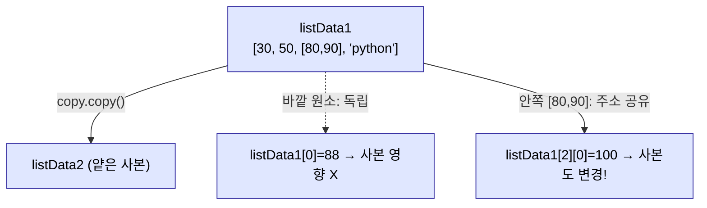
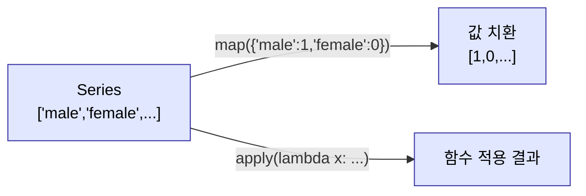
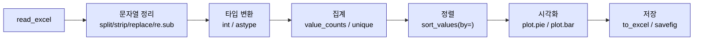

# 2026-05-28 pandas 함수 적용(map/apply)·전처리·시각화 복습 자료

> 수업 필기(`list_copy_exam.py`, `dataframe.py`, `pandas_function_exam1.py`, `pandas_dunction_test.py`, `pandas_function_exam3.py`, `pandas_function_exam4.py`)를 주제별로 재구성하고 설명을 덧붙였습니다.

---

## 0. 큰 그림 — 오늘의 주제

- **함수 적용(function application)** = DataFrame/Series 의 **각 요소(또는 각 행/열)에 함수를 일괄 적용**하는 기능. 반복문 대신 `map`/`apply` 로 한 방에.
- 실전 전처리 흐름: **읽기 → 문자열 정리(`split`/`strip`/`replace`/`re.sub`) → 타입 변환(`astype`/`int`) → 집계(`value_counts`/`unique`) → 정렬(`sort_values`) → 시각화(`plot.pie`/`plot.bar`)**.
- 곁들여: **얕은 복사 vs 깊은 복사**, **fancy 인덱싱**, **lambda(익명 함수)**.

---

## 1. 얕은 복사 vs 깊은 복사 (`list_copy_exam.py`)

```python
import copy

listData1 = [30, 50, [80, 90], 'python']   # ★ 리스트 안에 리스트(중첩)

## ① 대입 — 복사가 아니다!
listData2 = listData1          # 같은 객체를 두 변수가 함께 가리킴(주소 공유)
                               # id(listData1) == id(listData2) → True

## ② 얕은 복사(shallow copy)
listData2 = copy.copy(listData1)
listData1[0] = 88              # 바깥(1단계) 원소 변경 → 사본엔 반영 X (id 다름)

## ③ 중첩 리스트의 함정
listData2 = copy.copy(listData1)
listData1[2][0] = 100          # 안쪽 리스트 변경 → 사본에도 반영됨! (안쪽은 주소 공유)
```

| 방식 | 코드 | 바깥 원소 | 안쪽(중첩) 객체 |
|---|---|---|---|
| 대입 | `b = a` | 공유 | 공유 |
| 얕은 복사 | `copy.copy(a)` | **독립 복제** | 여전히 **공유** |
| 깊은 복사 | `copy.deepcopy(a)` | 독립 복제 | **독립 복제** |

- **대입(`=`)** 은 복사가 아니라 같은 객체의 주소를 한 번 더 가리키는 것. `id()` 로 확인하면 동일.
- **얕은 복사** 는 1단계 원소까지만 새로 만든다. **안쪽에 든 리스트·딕셔너리는 주소만 복사**되어 원본과 공유 → 한쪽을 바꾸면 양쪽이 바뀐다.
- ★ **리스트 안에 리스트(중첩 구조)** 가 있으면 사본을 만들 땐 반드시 **`copy.deepcopy()`** 를 써야 안전.



---

## 2. Fancy 인덱싱 (`dataframe.py`)

```python
df = pd.DataFrame(dictData, index=['kor', 'eng', 'math', 'music', 'science'])

# fancy 인덱싱 — 뽑고 싶은 인덱스들의 "리스트"를 전달
df.iloc[[1, 3], :]      # 1행, 3행만 골라서 추출(퐁당퐁당 cherry-pick)
```

- **fancy 인덱싱** = 연속 슬라이싱이 아니라, **추출할 인덱스를 리스트로 모아** 한 번에 뽑기.
- `df.iloc[[1, 3], :]` — 1행과 3행만, 모든 열. 슬라이싱 `1:3`(연속)과 달리 **원하는 위치만 골라낸다**.
- 컬럼 여러 개 고를 때 쓰는 `df[['Hong', 'Park']]` 도 같은 원리(리스트로 감싸기).

---

## 3. 내장 집계함수 — NumPy vs pandas (`pandas_function_exam1.py`)

```python
arr = np.arange(1, 10).reshape(3, 3)
arr.max(axis=0)          # NumPy 집계: sum, min, max, mean (+ axis)

df = pd.DataFrame(arr, columns=['a', 'b', 'c'])
df['a'].mean()           # pandas 도 동일 이름의 집계 메서드 제공
df['a'].max()
```

- NumPy 와 pandas 모두 `sum / min / max / mean` 같은 **집계 메서드**를 같은 이름으로 제공.
- pandas 는 컬럼(Series) 단위로 `df['a'].mean()` 처럼 바로 호출 가능.

---

## 4. lambda — 익명 함수 (`pandas_function_exam1.py`)

```python
def MyAddFunc(arg):      # 일반 함수: 이름 붙여 정의
    return arg + 5

# lambda: 한 줄짜리 익명 함수 — 매번 def 쓰기 귀찮을 때
f = lambda x: x + 5              # x: 매개변수, ':' 뒤가 return 값
f = (lambda x: x + 5)(7)         # 정의하자마자 7을 즉시 전달 → 12
f = lambda x=7: x + 5            # 기본 인자값도 가능

# 거듭제곱 세 가지 방법 (모두 125)
5 ** 3
np.power(5, 3)
(lambda x: x ** 3)(5)
```

- **lambda(익명 함수)** — `lambda 매개변수: 반환식`. 이름 없이 즉석에서 만드는 짧은 함수.
- `map`/`apply` 처럼 **함수를 인자로 넘기는 자리**에 특히 유용(이름 붙일 필요가 없으니).
- 거듭제곱: 파이썬 `**`, NumPy `np.power`, lambda 등 여러 방법.

---

## 5. 함수 적용 — `map` vs `apply` (`pandas_function_exam1.py`)

> **함수 적용**: DataFrame/Series 의 각 요소에 특정 함수를 **일괄 적용**.

```python
# Series 의 각 요소에 +3
df2 = df[['Hong']].map(lambda x: x + 3)

## ── map: 딕셔너리 매퍼 or 함수 ──
df['성별'] = ['male', 'female', 'male', 'female', 'male']

# ① 함수로 매핑
def DataControl(arg):
    return 1 if arg == 'male' else 0
df['성별'].map(DataControl)         # Series 넣으면 Series 반환

# ② 딕셔너리로 매핑 (가장 간결) — 값을 코드로 치환할 때 최고
df['성별'] = df['성별'].map({'male': 1, 'female': 0})

## ── apply: 함수 적용에 주로 사용 ──
def ScoreIncrease(arg):
    return arg + 3
df['Hong'] = df['Hong'].apply(ScoreIncrease)
df['Hong'] = df['Hong'].apply(lambda x: x + 5)   # lambda 와 자주 짝
```

| 도구 | 주 용도 | 특징 |
|---|---|---|
| `map` | **값 치환** | **딕셔너리 매퍼** `{원본: 변환}` 를 받을 수 있음 (Series 전용) |
| `apply` | **함수 적용** | 함수/lambda 를 각 요소(또는 행/열)에 적용. 실무에서 가장 많이 |

- 최신 pandas 에서는 `applymap` 이 `map` 으로 통합됨(DataFrame 에도 `.map()`).
- ★ **갱신 주의**: `df['Hong'] = df['Hong'].apply(...)` 처럼 **원래 컬럼에 다시 대입**해야 원본에 반영. 그냥 `df2 = ...` 로 받으면 새 Series 가 따로 생길 뿐 원본은 그대로.
- 단순 값 치환은 `map({...})`, 로직이 들어가면 `apply(함수/lambda)` 가 손에 익는 기준.



---

## 6. apply + 정규식으로 조건 필터 (`pandas_dunction_test.py`)

```python
import re

## 호선_명칭 중 "숫자가 들어간" 행만 추출
def Find(arg):
    return len(re.findall(r'[0-9]+', arg)) > 0   # 숫자가 1개라도 있으면 True

df.loc[df['호선_명칭'].apply(Find), :]    # apply 결과(불린 Series)를 불린 색인으로
```

- `apply(함수)` 가 **각 행마다 True/False** 를 돌려주면, 그 **불린 Series 를 그대로 `loc` 색인**으로 쓸 수 있다 → 조건 필터.
- 정규식 `re.findall(r'[0-9]+', s)` 의 결과 길이로 "숫자 포함 여부"를 판별하는 패턴.

---

## 7. 집계 실습 — `tips.csv` (`pandas_dunction_test.py`)

```python
df = pd.read_csv('.\\src\\20260528\\tips.csv', encoding='CP949')

# 성별을 0/1 로 인코딩 (딕셔너리 매퍼)
df['gender'] = df['gender'].map({'Male': 0, 'Female': 1})

# 요일 종류 개수
len(df['day'].unique())          # 고유값 개수

# 'Sat', 'Thur' 요일만 추출 (isin)
dayList = ['Sat', 'Thur']
subset = df.loc[df['day'].isin(dayList), :].copy()

# 토·목 인원수(size) 평균
subset['size'].mean()
```

- `unique()` → 어떤 값들이 있는지, `len(... .unique())` → 종류 개수.
- `isin([목록])` → 여러 카테고리 한 번에 필터(여러 `==` + `concat` 보다 깔끔).
- 추출 후 가공할 땐 `.copy()` 로 view 관계를 끊는 습관.

---

## 8. 실전 ① — 유튜브 랭킹 전처리 (`pandas_function_exam3.py`)

```python
df = pd.read_excel('src\\20260528\\youtube_rank_1000.xlsx', index_col=0)  # 0번 컬럼을 인덱스로

## 채널명에서 첫 단어만 남기기
df['ChannelName'] = df['ChannelName'].apply(lambda x: x.split(' ')[0])
# 또는 map 으로
df['ChannelName'] = df['ChannelName'].map(lambda x: x.split()[0])

df.to_excel('src\\20260528\\youtube_data.xlsx')   # 가공 결과 엑셀로 저장

## 카테고리 빈도수 직접 세기 — global + apply 부작용 활용
categoryList = dict()
def CategoryFerq(arg):
    global categoryList                  # 함수 밖 딕셔너리를 함수 안에서 수정하려면 global
    category = arg.strip('[').strip(']')  # 양쪽 대괄호 제거
    if category not in categoryList:
        categoryList[category] = 1
    else:
        categoryList[category] += 1

df['Category'].apply(CategoryFerq)        # 반환값이 아니라 "부작용"으로 dict 채움

# 딕셔너리 → DataFrame (키를 인덱스로)
myDf = pd.DataFrame.from_dict(categoryList, orient='index', columns=['Freq'])
myDf.sort_values('Freq', ascending=False, inplace=True)   # 내림차순 정렬

df2 = myDf.iloc[:5, 0].copy()   # 상위 5개 Series
df2.plot.pie()                  # 파이 차트
plt.show()
```

- `read_excel(..., index_col=0)` — 첫 컬럼을 곧장 인덱스로.
- `strip('[')` 는 **양끝의 해당 문자들을 제거**(문자열 끝의 `[`, `]` 떼기).
- `global` — 함수 내부에서 **바깥 변수를 수정**하려면 선언 필요. 여기선 `apply` 가 각 행을 돌며 dict 를 누적(반환값이 아닌 **부작용**으로 빈도 집계).
- `pd.DataFrame.from_dict(d, orient='index')` — 딕셔너리의 **키를 인덱스**, 값을 데이터로.
- `sort_values('열', ascending=False, inplace=True)` — 특정 열 기준 정렬.

---

## 9. 실전 ② — 문자열→숫자 변환·정렬·차트 옵션 (`pandas_function_exam4.py`)

### 9-1. 문자열로 저장된 수치 컬럼을 int 로

```python
df = pd.read_excel('src\\20260528\\youtube_rank_1000.xlsx')

# '1,234개' 같은 문자열에서 콤마·'개'를 떼고 int 변환 — 세 가지 방법
# ① 함수
def ToInt(arg):
    return int(arg.strip('개').replace(',', ''))
df['Video'] = df['Video'].apply(ToInt)

# ② lambda + strip/replace
df['Video'] = df['Video'].map(lambda x: int(x.strip('개').replace(',', '')))

# ③ lambda + 정규식 (가장 견고: 콤마와 '개'를 한 번에 제거)
df['Video'] = df['Video'].map(lambda x: int(re.sub(r'[,개]', '', x)))

# df['Video'].astype('int64')   # 특정 컬럼을 일괄 타입 변환(이미 깨끗한 수치일 때)
```

- 엑셀에서 읽은 수치가 `1,234개` 처럼 **문자열**이면 연산·정렬이 안 된다 → **불필요 문자 제거 후 `int()`**.
- `re.sub(r'[,개]', '', x)` — 콤마와 '개' 를 **빈 문자열로 치환**(여러 문자를 한 패턴으로).
- 이미 정상 수치 컬럼이면 `df['col'].astype('int64')` 로 타입만 일괄 변환.

### 9-2. 다중 컬럼 정렬 & 빈도표

```python
df.sort_values(by=['Video'], ascending=False, inplace=True)  # by에 리스트 → 여러 컬럼 정렬 가능

## value_counts — 카테고리 빈도를 한 줄로
data = df['Category'].value_counts()        # Series 반환(값별 개수, 내림차순)
dataDf = pd.DataFrame(data=data)            # Series → DataFrame

dataDf.index.name = ''                      # 인덱스 이름 제거(엑셀 저장 시 행 하나로 잡히는 것 방지)
dataDf.rename(columns={'count': 'CategoryFreq'}, inplace=True)  # 컬럼명 변경
dataDf_top5 = dataDf.head(5).copy()
```

- `value_counts()` — **각 값의 등장 횟수**를 내림차순 Series 로. (`from_dict`+`apply` 수작업의 간편 버전!)
- `df.sort_values(by=['a', 'b'], ...)` — `by` 에 **리스트**를 주면 여러 컬럼 우선순위 정렬.
- `rename(columns={'old': 'new'})` — 일부 컬럼명만 골라 변경. `df.columns = [...]` 는 통째 교체.
- `df.index.name = ''` — 인덱스 라벨 이름 비우기(저장 시 깔끔).

### 9-3. 시각화 — pie / bar / 저장

```python
## 파이 차트 + 옵션
dataDf_top5.plot.pie(
    y='CategoryFreq',
    colors=color,
    legend=False,
    startangle=90,                  # 시작 각도
    wedgeprops={'width': 0.5,       # 0<width<1 → 도넛 모양
                'edgecolor': 'black', 'linewidth': 3},
    autopct='%.2f%%',               # 조각에 퍼센트 표시
    explode=[0.1] * len(dataDf_top5.index),  # 조각 살짝 분리
)
plt.show()

## 막대 차트 + 색상 + 저장
df2.plot.bar(color=['lightskyblue', 'lightsalmon', 'lightpink', ...])
plt.savefig('src\\20260528.jpeg')   # 이미지 파일로 저장
plt.show()
```

| 차트/옵션 | 의미 |
|---|---|
| `plot.pie()` | 파이(원) 차트 |
| `plot.bar()` | 막대 차트 (`color=[...]` 로 색 지정) |
| `autopct='%.2f%%'` | 각 조각에 비율(%) 표기 |
| `explode=[0.1]*n` | 조각을 중심에서 떼어 강조 |
| `wedgeprops={'width':0.5}` | 도넛형, 테두리 두께/색 |
| `startangle=90` | 첫 조각 시작 각도 |
| `plt.savefig('파일.jpeg')` | 그래프를 이미지로 저장 |

- 한글 라벨이 깨지지 않도록 상단에서 **한글 폰트 설정**(맑은 고딕)을 먼저 해 둔다(27일 자료 참고).
- `PrettyTable` + `df.itertuples()` 로 표를 보기 좋게 출력하는 헬퍼도 재사용.
- **seaborn**(`sns.barplot(data=, x=, y=, hue=, palette=)`)은 더 예쁜 통계 차트용 라이브러리(주석으로 소개).



---

## 10. 오늘의 핵심 한눈에

| 주제 | 핵심 키워드 |
|---|---|
| 복사 | 대입(공유) vs `copy.copy`(얕은) vs `copy.deepcopy`(깊은) — **중첩이면 deepcopy** |
| fancy 인덱싱 | `df.iloc[[1, 3], :]` — 인덱스 **리스트**로 골라 추출 |
| 집계 | `sum/min/max/mean` (NumPy·pandas 공통, `axis`) |
| lambda | `lambda x: x+5`, 즉시호출 `(lambda x:..)(7)`, 기본값 |
| 거듭제곱 | `**`, `np.power`, lambda |
| 함수 적용 | **`map`(값 치환·dict 매퍼) / `apply`(함수 적용)** |
| 갱신 | `df['col'] = df['col'].apply(...)` 처럼 **재대입** 필수 |
| apply 필터 | `df.loc[df['c'].apply(조건함수), :]` |
| 고유값/필터 | `unique()`, `len(unique())`, `isin([목록])` |
| 빈도 | `value_counts()`(간편) vs `global dict + apply`(수작업) |
| dict→DF | `pd.DataFrame.from_dict(d, orient='index')` |
| 정렬 | `sort_values(by=[...], ascending=, inplace=)` |
| 컬럼명 | `rename(columns={'old':'new'})`, `index.name=''` |
| 문자열→수치 | `strip`/`replace`/`re.sub` 후 `int()`, `astype('int64')` |
| 파일 | `read_excel(index_col=0)`, `to_excel`, `savefig` |
| 시각화 | `plot.pie`(autopct/explode/wedgeprops/startangle), `plot.bar(color=)`, seaborn |

> 다음 단계: `groupby` 집계·집약, `pivot_table`, `merge`/`join`/`concat` 결합, `agg`(여러 통계 동시), `pd.cut`/`qcut`(구간화), seaborn 본격 시각화(`heatmap`, `boxplot`, `pairplot`).
