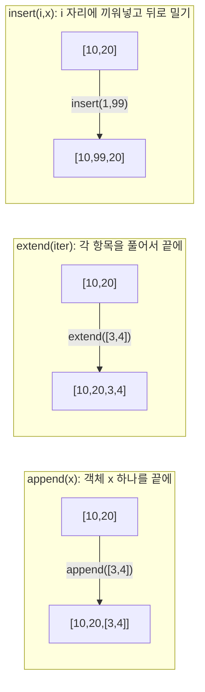
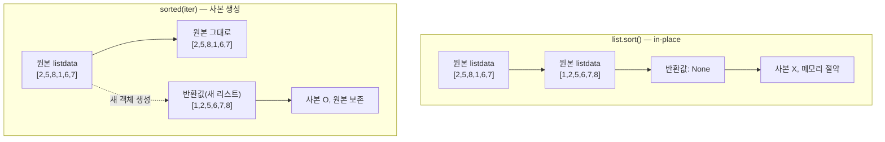
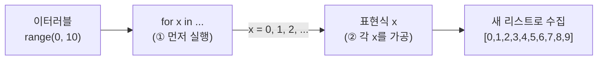
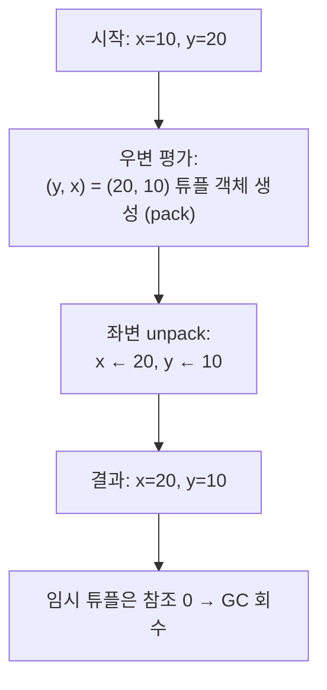
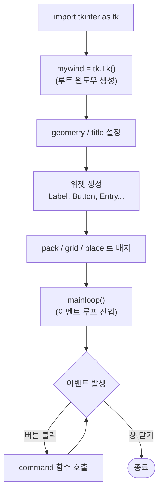

# 2026-05-19 파이썬 자료구조·모듈·GUI 복습 자료

> 수업 필기(`string__review.py`, `list_exam1~4.py`, `list_test.py`, `tuple_exam1.py`, `dictionary_exam1.py`, `dictionary_exam2.py`, `ditcionary_test.py`, `xlsxReader_exam.py`, `GUI_exam.py`, `module_test/*.py`)를 주제별로 재구성하고 설명을 덧붙였습니다.

---

## 0. 지난 시간 복습 — 객체와 시퀀스

### 0-1. 모든 것은 객체, 변수는 id를 담는 그릇

```python
data1 = "python"   # 동적 타이핑 → str 객체 자동 생성, data1은 그 id를 가리킴
```

- 파이썬은 **객체지향 언어(OOP)**. 모든 값은 어떤 **클래스로부터 생성된 객체**.
- 변수는 값 자체가 아니라 **객체의 id(메모리 주소)** 만 담는다.
- 객체 생성의 정식 문법은 `클래스명(...)` 이지만, 리터럴(`"python"`, `50`, `[]`)을 쓰면 자동으로 생성된다.

### 0-2. 시퀀스 타입(sequence) 공통 기능

- **시퀀스** = 순서가 있는 자료형: `str`, `list`, `tuple`, `range` ...
- 공통적으로 지원하는 연산
  - **색인(indexing)**: `data[i]` — 항상 `0` 부터 시작.
  - **슬라이싱(slicing)**: `data[start:stop]` — `stop` 은 포함되지 않음.
  - `+` (연결), `*` (반복) 연산.
  - `len(x)`, `in` 키워드.
  - `for item in x:` 로 순회 가능.

```python
data1 = "python"
data1[0]      # 'p'
data1[1:3]    # 'yt'
data1 + "800" # 'python800'  (타입 같아야 함)
data1 * 5     # 'pythonpythonpythonpythonpython'
list(data1)   # ['p','y','t','h','o','n']  ← 타입변환
```

### 0-3. 메서드는 "객체에게 일 시키기"

- `객체.메서드()` 형태로 호출 → "그 객체에게 작업을 시킨다".
- `str` 의 대표 메서드: `join`, `replace`, `format`, `split`, `strip`, `upper`, `lower` ...
- **불변(immutable)** 객체(`str`, `tuple`)는 변형 메서드가 **새 객체를 반환**하며 원본은 그대로다.

---

## 1. 리스트(`list`) — 가변 시퀀스

### 1-1. 생성 문법 — 리터럴 vs 클래스 호출

```python
data1 = list()   # 클래스 호출 — 빈 리스트
data2 = []       # 리터럴(파이토닉, 더 권장)
print(data2, type(data2))   # [] <class 'list'>
```

- 결과는 동일. 짧고 익숙한 **리터럴**(`[]`) 이 권장 표기.

### 1-2. 리스트는 "읽고 쓸 수 있는" 시퀀스

```python
data2 = []
# data2[0] = 50      # IndexError — 빈 리스트에는 인덱스 자체가 없다
data2.append(50)
data2.append(80)
print(data2)         # [50, 80]
print(data2[0])      # 50  (read)
data2[0] = 99        # write OK — 문자열과 달리 항목 수정 가능
```

- **문자열과의 결정적 차이**: 리스트는 **mutable** 이라 인덱스로 항목을 **수정**할 수 있다.
- 단, 빈 리스트에는 메모리 슬롯이 없어 `[i]` 로 바로 할당할 수 없다 → 먼저 `append` 등으로 추가해야 한다.

### 1-3. 항목 타입은 자유 — 중첩까지 가능

```python
data3 = []
data3.append(60)
data3.append('python')              # 문자열 OK
data3.append(5.9)                   # 실수 OK
data3.append(["programming", [90, "nvi"]])   # 리스트의 리스트
print(data3[3][1][1])               # 'nvi' — 다단계 인덱싱
```

- 문자열은 "문자만" 들어가지만, **리스트는 어떤 타입의 객체든** 항목으로 올 수 있다.
- 중첩 리스트는 `data[i][j][k]` 처럼 **연쇄 인덱싱**으로 접근.

### 1-4. 추가 메서드 비교 — `append` vs `extend` vs `insert`

```python
data3.append(50)               # 단일 객체를 "통째로" 뒤에 붙임
data3.extend([50, 60, 70])     # 이터러블을 풀어서 각각 뒤에 붙임
data3.insert(2, 30)            # 인덱스 2 자리에 30 삽입, 나머지는 뒤로 밀림
```

| 메서드 | 받는 인자 | 동작 |
|---|---|---|
| `append(x)` | 객체 1개 | 끝에 그대로 1개 추가 |
| `extend(iterable)` | **이터러블** | 각 항목을 풀어 여러 개 추가 |
| `insert(i, x)` | 위치 + 객체 | 위치 `i` 에 끼워 넣고 뒤를 밀어냄 |

- `extend(50)` 처럼 **이터러블이 아닌 단일 값**을 주면 `TypeError`.
- 헷갈리는 차이: `data.append([1,2])` 는 `[..., [1,2]]` 가 되지만, `data.extend([1,2])` 는 `[..., 1, 2]` 가 된다.

**시각화** — 같은 시작 리스트 `[10, 20]` 에 각 메서드 한 번 호출 결과:

```
시작:   [10, 20]

append([3, 4])              extend([3, 4])              insert(1, 99)
─────────────────           ─────────────────           ─────────────────
[10, 20, [3, 4]]            [10, 20, 3, 4]              [10, 99, 20]
        ▲                          ▲  ▲                      ▲
        │                          │  │                      │
   "통째로" 1개 추가            풀어서 각각 추가          1번 자리에 끼워넣고
                                                          나머지는 뒤로 밀림
```



### 1-5. 길이와 삭제

```python
print(len(data3))   # 항목 개수
del data3[4]        # 인덱스 4 항목 삭제
```

- `len(x)` 는 시퀀스 공통 함수.
- 항목 삭제는 여러 방법(`pop`, `remove`)이 있지만 **`del` 키워드** 가 가장 범용. 다른 자료형(`dict`, 변수 자체 등)에서도 같은 키워드로 통일된다.

### 1-6. 리스트 연산 — `+`, `*`

```python
listdata1 = [40, 30, 10]
listdata2 = [50, 39, 123]
print(listdata1 + listdata2)    # [40,30,10,50,39,123] — 연결
# listdata1 - listdata2         # 지원하지 않음 (NumPy 필요)

listtmp = [None] * 10           # 길이 10짜리 자리 미리 확보(원형 큐 등)
listtmp[9] = 40
```

- 리스트끼리 `+` 는 **연결**, 정수와 `*` 는 **반복**.
- `[None] * n` 패턴은 **알고리즘에서 메모리 슬롯을 미리 확보**할 때 자주 사용.

### 1-7. 각 항목에 수치 연산을 하려면? → NumPy

```python
# [5,6,7,8] + 3       # TypeError — 리스트는 항목별 덧셈 미지원
[5,6,7,8] + [3]       # [5,6,7,8,3] — 뒤에 붙을 뿐 항목 더하기가 아님

import numpy as np
arr1 = np.array([99, 22, 33, 35])
print(arr1 + 3)       # [102 25 36 38]  ← 각 항목에 3을 브로드캐스트
```

- 파이썬 리스트는 **수치 연산용 자료구조가 아님**. 항목별 연산은 `for` 로 가능하나 비효율.
- **NumPy**(외부 라이브러리) 의 `ndarray` 는 항목별 수치 연산을 **shape를 맞춰 자동 확장(broadcasting)** 하며 처리.
- 설치 (가상환경 활성화 상태에서)
  ```bash
  pip install numpy
  pip install numpy==2.2.6   # 특정 버전(공백 없음!)
  pip list                   # 설치된 패키지 확인
  ```
- 별칭: `import numpy as np` — 긴 이름을 `np` 로 줄여 쓴다.

---

## 2. 리스트 정렬 — `sort()` vs `sorted()`

### 2-1. `list.sort()` — 원본을 직접 정렬, 반환값 없음

```python
listdata = [2, 5, 8, 1, 6, 7]
listdata.sort()           # 원본을 오름차순으로 변경
# listdata.sort(reverse=True)   # 내림차순
```

- **반환값이 없다(None)**. 그래서 `result = listdata.sort()` 처럼 받으면 `result == None` 이 되어 버린다.
- 파이썬은 `return` 이 없는 함수에서 자동으로 **`None` 객체** 를 돌려준다.
- 원본을 직접 바꾸므로 **사본 객체를 생성하지 않아 메모리 효율적**.

### 2-2. `sorted(iterable)` — 정렬된 사본을 반환, 원본 유지

```python
sortedList = sorted(listdata)                # 새 리스트 반환
reverseSorted = sorted(listdata, reverse=True)
print(listdata)   # 원본은 그대로
```

- 결과를 **변수로 받아야** 의미가 있다.
- 원본을 보존해야 하거나, **다른 시퀀스(튜플, 문자열 등)** 를 정렬할 때 유용.
- 트레이드오프: **메모리 사본** 이 생긴다.

> **언제 무엇을 쓰나** — 원본 자체가 정렬돼야 하고 메모리도 아껴야 하면 `sort()`, 원본을 보존하거나 일회용 정렬이면 `sorted()`.

**시각화** — 두 방식의 메모리·반환값 차이:



---

## 3. `range` 와 리스트 컴프리헨션(list comprehension)

### 3-1. `range` — 범위 데이터 생성기

```python
print(range(10))         # range(0, 10) — 객체 자체는 보이지 않음
print(list(range(10)))   # [0,1,2,3,4,5,6,7,8,9]
list(range(30, 41))      # 30~40
list(range(0, 11, 2))    # 0,2,4,6,8,10  (step)
```

- `range(stop)` / `range(start, stop)` / `range(start, stop, step)`.
- 그 자체는 출력해도 별 의미가 없다 → **`for` 와 함께 쓰거나 `list()` 로 변환**해서 사용.

### 3-2. 리스트 컴프리헨션 — 파이토닉한 리스트 생성

```python
# ❌ Not pythonic
listdata = []
for x in range(0, 10):
    listdata.append(x)

# ✅ Pythonic — 리스트 내포(컴프리헨션)
listdata = [x for x in range(0, 10)]
```

- 문법: `[표현식 for 변수 in 이터러블]`
- 안쪽 **for 문이 먼저 실행**되고, 각 회차의 결과를 `표현식` 으로 가공해 새 리스트의 항목으로 모은다.

**시각화** — 컴프리헨션을 읽는 순서 (오른쪽 for → 왼쪽 표현식):



읽는 방향:

```
   [  x   for x in range(0, 10)  ]
      ▲   ▲   ▲   ▲
      │   │   │   │
      ②   ①   ①   ①  ← for 문이 먼저 돌면서 x를 결정한 뒤,
                       ② 각 x를 표현식으로 가공해 새 리스트에 모음
```

### 3-3. 필터링(`if`)과 변환을 동시에

```python
[x for x in range(0, 11) if x % 2 == 0]
# [0, 2, 4, 6, 8, 10]   ← 짝수만

[str(x + 5) for x in range(0, 11) if x % 2 == 0]
# ['5','7','9','11','13','15']   ← 짝수 + 5 후 문자열로 변환
```

- 뒤에 `if 조건` 을 붙이면 **조건을 통과한 항목만** 모은다.
- `표현식` 자리에 임의의 변환식을 쓸 수 있다(`str()`, `x*2`, `x.strip()` 등).

### 3-4. 실전 예 — 문자열 자르고 공백 다듬기

```python
mystr = "kbs, mbc, sbs"

# ❌ Not pythonic
mylist = []
for item in mystr.split(','):
    mylist.append(item.strip())

# ✅ Pythonic
mylist = [x.strip() for x in mystr.split(',')]
# ['kbs', 'mbc', 'sbs']
```

연습:

```python
mystr1 = "Python, STudy, GooD"
result = [x.lower().strip() for x in mystr1.split(',')]
# ['python', 'study', 'good']
```

### 3-5. `enumerate` — 인덱스와 값을 동시에

```python
mylistdata = ['python', 'frog', 'good']
for index, item in enumerate(mylistdata):
    print(index, ":", item)
# 0 : python
# 1 : frog
# 2 : good
```

- `enumerate(iterable)` 는 `(index, value)` 튜플들을 만들어 준다.
- "현재 몇 번째인지" 가 필요할 때 `i = 0; i += 1` 패턴 대신 사용.

---

## 4. 리스트 응용 — 중첩 리스트와 점수 입력 예제

```python
scoreList = [['Kor'], ['Eng'], ['Math']]

kor  = input("국어 점수 입력: ")
eng  = input("영어 점수 입력: ")
math = input("수학 점수 입력: ")

scoreList[0].append(kor)
scoreList[1].append(eng)
scoreList[2].append(math)
print(scoreList)   # [['Kor','90'], ['Eng','80'], ['Math','70']]

# input() 은 항상 str → 합계/평균은 int() 캐스팅 필수
total = int(kor) + int(eng) + int(math)
avg   = total / 3
print(f"총점: {total:.2f}")
print(f"평균: {avg:.2f}")
```

### 4-1. f-string의 서식 지정자 `:.2f`

```python
f"{3.14159:.2f}"   # '3.14'
f"{42:>5}"         # '   42'  (5칸 오른쪽 정렬)
f"{255:#x}"        # '0xff'
```

- `{값:서식}` 형태로 **출력 형식**을 지정.
- `:.2f` = 실수, 소수점 둘째 자리까지.
- 서식 지정자는 C의 `printf` 와 비슷하지만 **변수 옆에 바로 붙여서** 가독성이 더 좋다.

---

## 5. 튜플(`tuple`) — 불변 시퀀스

### 5-1. 생성 문법과 함정 — "괄호 하나는 튜플이 아니다"

```python
data1 = ()              # 빈 튜플
data2 = (50)            # 그냥 int!  ← (괄호)는 우선순위 연산자로 처리
data3 = (50,)           # 콤마가 있어야 튜플
```

- **항목이 하나뿐인 튜플은 반드시 끝에 콤마**(`(50,)`) 를 붙인다.
- 그렇지 않으면 파이썬이 `()` 를 **연산 우선순위용 괄호** 로 해석한다.

### 5-2. 어떤 객체든 항목으로 가능 + 인덱싱 가능

```python
data4 = (50, 30, 'asdasd', [10, 2, 3])
print(data4[3][1])         # 2  — 인덱싱은 가능
data4[3][1] = 100          # OK — 내부 리스트는 mutable
# data4[1] = 100           # TypeError — 튜플 자체는 immutable
```

- 튜플은 **자기 자신의 항목을 교체할 수 없다**(immutable). 하지만 항목이 가리키는 객체가 가변(list 등) 이면 그 내부는 바꿀 수 있다.

### 5-3. 패킹(pack) / 언패킹(unpack)

```python
data5 = 50, 60, 70, 80   # 괄호 없이도 자동으로 튜플로 묶임 (packing)
a, b, c = (5, 3, 2)      # 튜플을 풀어서 변수에 분배 (unpacking)
print(a, b, c)           # 5 3 2

# 변수 교환 — 임시변수 없이!
x, y = 10, 20
x, y = y, x              # x=20, y=10
```

- 튜플의 **패킹/언패킹** 은 파이썬에서 매우 자주 쓰이는 관용구.
- 함수의 다중 반환값(`return a, b`) 도 사실은 **하나의 튜플**을 반환하는 것.

**시각화** — `x, y = y, x` 의 swap 과정:



```
①  x = 10   y = 20            우변을 먼저 평가하여
                               (y, x) → (20, 10) 튜플로 pack
                                        ┌──────┬──────┐
                                        │  20  │  10  │
                                        └──────┴──────┘

②  좌변에서 unpack:                       │      │
    x = 첫 번째 = 20                      ▼      ▼
    y = 두 번째 = 10                      x     y
```

> **튜플 vs 리스트** — 둘 다 시퀀스지만 **튜플은 변경 불가**. "한 번 만들면 안 바뀔 데이터"(좌표, 설정값, 함수의 다중 반환 등) 에는 튜플이 안전하고 약간 더 빠르다.

---

## 6. 딕셔너리(`dict`) — 매핑 타입

### 6-1. 매핑 타입이란?

- 시퀀스가 "순서로 접근"한다면, **매핑(mapping)** 은 **key로 value를 찾는** 자료형.
- 대표가 `dict` 클래스. JSON 객체와 1:1로 대응되어 데이터 교환에 매우 유용.

### 6-2. 생성 문법과 함정

```python
dict1 = {}                # 빈 딕셔너리
dict2 = {50}              # ⚠️ set 타입이 된다! (key:value 가 아니므로)
dict3 = {'key1': 50}      # 정상 — key는 상수 객체(주로 str/int)
```

- 빈 중괄호 `{}` 는 **dict** 이지만, **항목만 있는 `{50}` 은 set**.
- key 로는 보통 **불변 객체**(`str`, `int`, `tuple`) 만 사용한다.

### 6-3. CRUD — 추가/읽기/수정/삭제

```python
dict4 = {}

# Create — 없는 key 에 할당하면 새로 생성
dict4['key1'] = 'value'

# Read
print(dict4['key1'])      # 'value'

# Update — 있는 key 에 다시 할당하면 덮어씀
dict4['key1'] = 30
print(dict4['key1'])      # 30

# Delete — del 키워드 사용
del dict4['key1']
print(dict4)              # {}
```

- 같은 `dict[key] = value` 문법이 **신규 추가** 와 **기존 수정** 둘 다 한다.
- 없는 key 를 **읽으려고** 하면 `KeyError` 발생.

### 6-4. 반복문에서의 동작

```python
scoreDict = {'kor': 90, 'eng': 70, 'math': 30}

total = 0
for key in scoreDict:               # 변수에 'key' 가 전달됨!
    print(key, ':', scoreDict[key])
    total += scoreDict[key]         # 누적대입(+=)
print('total:', total)              # 190
```

- `for x in 사전:` 은 **key 만** 순회한다. (`value` 가 아니라!)
- 값까지 함께 쓰려면 `scoreDict[key]` 로 다시 접근하거나, 다음 메서드 사용
  - `for k, v in scoreDict.items():` — key, value 동시
  - `for v in scoreDict.values():` — value 만
  - `for k in scoreDict.keys():` — key 만 (기본 동작과 동일)

### 6-5. 누적 대입(augmented assignment) — `+=`

```python
total = 0
total += 90      # total = total + 90 과 동일
```

- `+=`, `-=`, `*=`, `/=`, `//=`, `%=`, `**=` 모두 동일한 패턴.
- "값을 누적해 나갈 때" 가장 흔히 쓰인다.

---

## 7. 딕셔너리 → 표(`pandas.DataFrame`) → 엑셀

### 7-1. dict 가 표 데이터의 자연스러운 표현

```python
import pandas as pd

scoredict = {
    'kor':  [80, 90, 70],
    'eng':  [77, 88, 55],
    'math': [33, 55, 66],
}
mydf = pd.DataFrame(scoredict)
print(mydf)
#    kor  eng  math
# 0   80   77    33
# 1   90   88    55
# 2   70   55    66

mydf.to_excel('mydf.xlsx')   # 엑셀 파일로 저장
```

- **key → 열(column) 이름**, **value 리스트 → 그 열의 값들**.
- 모든 value 리스트의 **길이가 같아야** 한다.
- `to_excel('파일명.xlsx')` 로 저장. (별도 패키지 `openpyxl` 등이 필요)

**시각화** — dict 가 어떻게 표로 펼쳐지는가:

```
        scoredict (파이썬)                       pd.DataFrame
   ┌──────────────────────────┐              ┌─────┬─────┬──────┐
   │ 'kor':  [80, 90, 70]     │              │ kor │ eng │ math │
   │ 'eng':  [77, 88, 55]     │  ─────►      ├─────┼─────┼──────┤
   │ 'math': [33, 55, 66]     │              │  80 │  77 │   33 │  ← row 0
   └──────────────────────────┘              │  90 │  88 │   55 │  ← row 1
       ▲           ▲                          │  70 │  55 │   66 │  ← row 2
       │           │                          └─────┴─────┴──────┘
      key →       value 리스트 →                 ▲
      열 이름       각 열의 값                     │
                                              열별로 세로로 채워짐
```

### 7-2. 엑셀 파일 읽기

```python
import pandas as pd
mydf = pd.read_excel('mydf.xlsx', index_col=0)
print(mydf)
```

- `index_col=0` 옵션 → 저장 시 만들어진 0번 컬럼(인덱스)을 **데이터로 읽지 않고 인덱스로** 처리.
- 이 옵션 없이 읽으면 `Unnamed: 0` 컬럼이 추가로 생긴다.

### 7-3. "딕셔너리의 리스트" 패턴 — 행 단위 데이터

```python
pets = [
    {'name': "구름",   "age": 5},
    {'name': "초코",   "age": 3},
    {'name': "아지",   "age": 1},
    {'name': "호랑이", "age": 1},
]

# 단순 반복
for item in pets:
    print(item['name'], str(item['age']) + '살')

# pandas 로 한번에 표 만들기
import pandas as pd
myData = pd.DataFrame(pets)
print(myData)

# 값들만 꺼내기
for item in pets:
    print(list(item.values()))   # ['구름', 5], ['초코', 3], ...
```

- JSON·API 응답에서 흔히 보는 **"리스트 안의 dict들"** 구조.
- `pd.DataFrame(리스트오브딕트)` 만 호출하면 **자동으로 표** 가 만들어진다.

> **dict 가 중요한 이유** — 외부 데이터(JSON, 엑셀, DB, API)는 거의 모두 **key-value 구조**로 들어온다. dict 조작에 익숙해지면 데이터 가공이 훨씬 자연스럽다.

---

## 8. 모듈(module) 과 `__name__ == '__main__'`

### 8-1. 파일명 = 모듈명

```python
# smartPhone_main.py
import camera_operation as cam      # camera_operation.py
import phone_call as ph             # phone_call.py

cam.picture_function()
ph.phone_call()
```

- 파이썬에서는 **`.py` 파일 하나가 곧 하나의 모듈**.
- `import 파일명` 으로 다른 파일의 함수·변수를 불러올 수 있다.
- `as 별칭` 으로 짧은 이름 부여.

### 8-2. `__name__` — 실행 모드냐, 임포트 모드냐

```python
# camera_operation.py
def picture_function():
    print('사진 기능 동작!')

if __name__ == '__main__':
    picture_function()
    print("__name__:", __name__)
```

- 모든 모듈에는 자동으로 만들어지는 **특수 변수 `__name__`** 이 있다.
- **직접 실행** (이 파일을 `python camera_operation.py` 로 돌렸을 때) → `__name__ == "__main__"`.
- **다른 파일에서 import** 됐을 때 → `__name__ == "camera_operation"` (파일명).

### 8-3. 왜 `if __name__ == '__main__':` 가 필요한가

```python
# camera_operation.py 안에 그냥 picture_function() 을 적으면…
picture_function()      # ⚠️ import 만 해도 실행돼 버린다!

# 이를 막으려면
if __name__ == '__main__':
    picture_function()   # 직접 실행할 때만 동작 — 테스트 코드 위치로 적합
```

- **모듈은 import 되는 순간 위에서 아래로 한 번 실행**된다.
- 모듈 최상단에 함수 호출을 그냥 적으면, **import 만 해도** 그 함수가 호출돼 버린다.
- `if __name__ == '__main__':` 블록 안에 두면 **그 파일을 직접 실행할 때만** 동작한다.
- 보통 이 블록에 **"이 모듈을 단독으로 돌렸을 때의 데모/테스트 코드"** 를 넣는다.

---

## 9. GUI 맛보기 — `tkinter`

### 9-1. 기본 윈도우와 메인 루프

```python
import tkinter as tk

mywind = tk.Tk()                          # 메인 윈도우 객체 생성
mywind.geometry("600x600+500+200")        # 크기 600x600, 위치 (500, 200)
# ... 위젯 배치 ...
mywind.mainloop()                         # 이벤트 루프 시작 (창이 화면에 뜸)
```

- `tkinter` 는 파이썬 **표준 라이브러리** 의 GUI 모듈(설치 불필요).
- 흐름: **윈도우 객체 생성 → 위젯 추가 → `mainloop()` 호출** 의 3단계.
- `mainloop()` 가 호출되어야 창이 실제로 뜨고, 사용자 입력을 받기 시작한다.

**시각화** — tkinter 앱의 라이프사이클과 위젯 트리:



위젯 부모-자식 트리:

```mermaid
flowchart TD
    root["Tk() 메인 윈도우<br/>(부모)"] --> lb["Label('numbering')"]
    root --> b1["Button('increase')<br/>command=IncreaseFunction"]
    root --> b2["Button('decrease')"]
    iv["IntVar numcnt"] -.textvariable.-> lb
    b1 -.클릭 시 .set/.get.-> iv
```

### 9-2. 제어 변수(`IntVar`, `StringVar`) — GUI ↔ 메모리 동기화

```python
numcnt = tk.IntVar()        # 정수 제어 변수
numcnt.set(0)               # 값 설정
numcnt.get()                # 값 읽기
```

- **위젯에 표시되는 값**과 **파이썬 변수의 값**을 자동으로 묶어 주는 다리.
- `numcnt.set(...)` 으로 값을 바꾸면 연결된 위젯의 표시도 즉시 갱신된다.

### 9-3. Label 과 Button

```python
lb1 = tk.Label(text="numbering", textvariable=numcnt)
lb1.pack()

def IncreaseFunction():
    numcnt.set(numcnt.get() + 1)

b1 = tk.Button(
    text="increase",
    padx=20, pady=20,
    background='blue',
    command=IncreaseFunction,    # 클릭 시 호출할 함수
    repeatdelay=500,
    repeatinterval=50,
)
b1.pack()
```

- **`Label`** : 정적인 글자(또는 `textvariable` 로 동적 글자) 표시용 위젯.
- **`Button`** : 클릭 가능한 버튼. `command=` 에 **함수 자체**(괄호 없이!) 를 넘기면 클릭 시 호출된다.
  - `command=IncreaseFunction` ✅ — 함수 참조 전달
  - `command=IncreaseFunction()` ❌ — 지금 한 번 호출해 그 결과(`None`)를 넘기는 꼴
- `repeatdelay`, `repeatinterval` : 버튼을 **누르고 있을 때 반복 호출** 되는 간격(ms).

### 9-4. 배치 매니저(`pack` / `grid` / `place`)

```python
b1.pack()
b2.pack(padx=10, pady=10)
```

- **자식 위젯을 부모 윈도우에 배치하는 3가지 방식**:
  - `pack` — 단순히 위→아래(또는 좌→우)로 쌓는다.
  - `grid` — 행/열 좌표로 격자에 배치.
  - `place` — 픽셀 절대 좌표로 배치.
- **한 컨테이너 안에서는 한 가지 방식만** 섞지 말고 사용해야 한다.

---

## 10. 한 줄 요약 체크리스트

- [ ] 시퀀스 타입은 `str`, `list`, `tuple`, `range` — 인덱싱·슬라이싱·`+`·`*`·`len`·`for` 공통 지원.
- [ ] `list()` 와 `[]` 는 같은 빈 리스트. `[]` 가 파이토닉.
- [ ] **빈 리스트** 에는 `[i] =` 할당 불가, **`append` 등으로 먼저 늘려야** 한다.
- [ ] `append(x)` 는 객체 1개, `extend(iter)` 는 풀어서 여러 개, `insert(i, x)` 는 끼워 넣기.
- [ ] 리스트끼리 `+` 는 연결, `[None]*n` 으로 자리 미리 확보.
- [ ] **각 항목 수치 연산** 은 `for` 보다 **NumPy 브로드캐스팅**.
- [ ] `list.sort()` 는 원본 변경 + 반환 `None`, `sorted(iter)` 는 사본 반환.
- [ ] 함수에 `return` 이 없으면 파이썬은 자동으로 **`None`** 을 돌려준다.
- [ ] `range()` 자체는 출력하면 의미 없음 → **`for` 와 함께** 또는 `list()` 변환.
- [ ] 리스트 컴프리헨션 `[표현식 for x in iter if 조건]` 이 가장 파이토닉.
- [ ] `enumerate(iter)` 로 인덱스와 값을 동시에 받는다.
- [ ] `f"{x:.2f}"` — f-string 안의 `:서식` 으로 출력 형식 지정.
- [ ] **항목 1개짜리 튜플** 은 `(50,)` — 콤마 필수!
- [ ] 튜플은 immutable, but 내부 mutable 객체의 내용은 변경 가능.
- [ ] 튜플 패킹/언패킹으로 **다중 대입**, **함수 다중 반환**, **변수 교환** 모두 가능.
- [ ] `{}` 는 dict, `{50}` 은 set — 빈 set 은 `set()` 으로 만든다.
- [ ] dict 의 `for k in d:` 는 **key** 만 순회한다.
- [ ] `+=`, `-=` 같은 누적 대입은 반복문 안에서 자주 쓰인다.
- [ ] `pandas.DataFrame(dict)` 로 표 생성, `to_excel/read_excel` 로 엑셀 입출력.
- [ ] **파일명 = 모듈명**. `import 파일명 as 별칭`.
- [ ] `if __name__ == '__main__':` — **직접 실행** 때만 동작, **import** 될 땐 무시. 테스트 코드 자리.
- [ ] `tkinter` 흐름: **`tk.Tk()` → 위젯 추가 → `mainloop()`**.
- [ ] Button 의 `command=함수` 는 **괄호 없이** 함수 자체를 넘긴다.

---

## 11. 셀프 체크 문제 (정답은 생각만)

1. 다음 코드의 출력은? 그 이유는?
   ```python
   a = []
   a[0] = 50
   print(a)
   ```
2. `append` 와 `extend` 의 차이를 한 문장으로 설명해 보세요. 아래 코드 각각의 결과는?
   ```python
   a = [1, 2]; a.append([3, 4]); print(a)
   b = [1, 2]; b.extend([3, 4]); print(b)
   ```
3. 리스트 컴프리헨션으로 1~20 사이의 3의 배수의 제곱들을 만들어 보세요.
4. 다음 코드에서 `result` 의 값은?
   ```python
   nums = [3, 1, 4, 1, 5, 9, 2, 6]
   result = nums.sort()
   ```
   `sorted` 로 같은 의도를 어떻게 표현하나요?
5. `("hi")` 와 `("hi",)` 의 차이를 설명하고, 각각의 `type()` 을 적어 보세요.
6. 두 변수의 값을 **임시 변수 없이** 교환하는 한 줄짜리 코드를 적어 보세요.
7. 다음 코드의 출력은?
   ```python
   d = {'a': 1, 'b': 2}
   for x in d:
       print(x)
   ```
   값까지 함께 출력하려면 어떻게 고쳐야 할까요?
8. `pets` 가 다음과 같을 때, 이름만 모은 리스트를 컴프리헨션으로 만들어 보세요.
   ```python
   pets = [{'name': '구름', 'age': 5}, {'name': '초코', 'age': 3}]
   ```
9. 모듈 `mylib.py` 안에 함수와 데모 코드가 함께 있을 때, **import 시에는 데모가 실행되지 않게** 하려면 어떻게 해야 할까요?
10. tkinter Button 의 `command=` 에 함수를 **괄호 없이** 넘기는 이유는 무엇일까요?
    (힌트: `IncreaseFunction` 과 `IncreaseFunction()` 의 평가 결과가 각각 무엇인지 생각해 보세요.)

> 풀이 힌트는 위 본문에 모두 들어 있습니다. 막히면 해당 절을 다시 읽어보세요!
