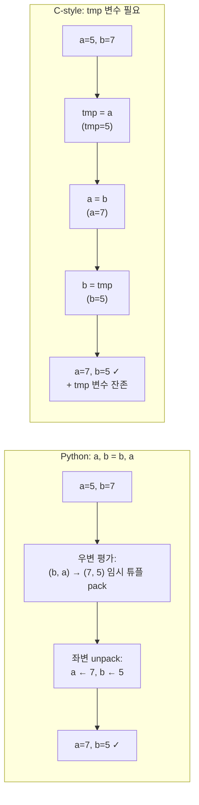
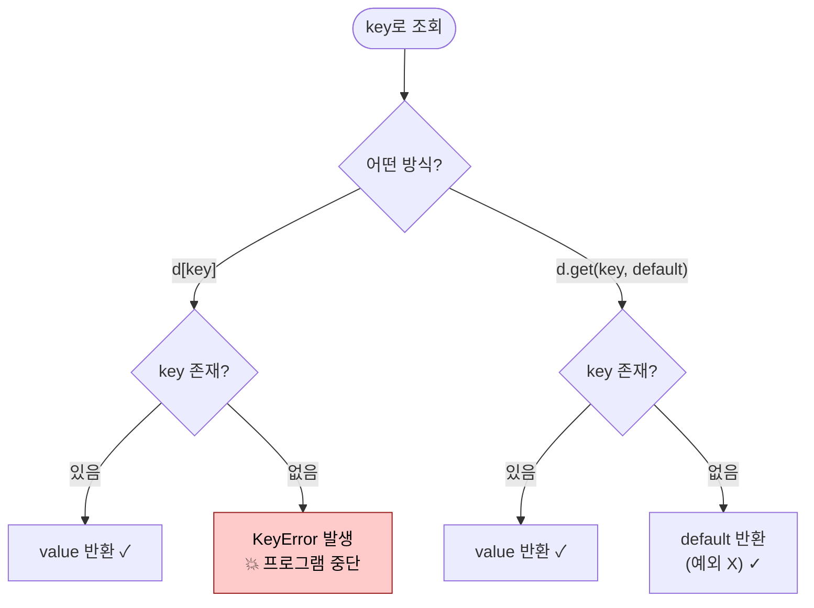
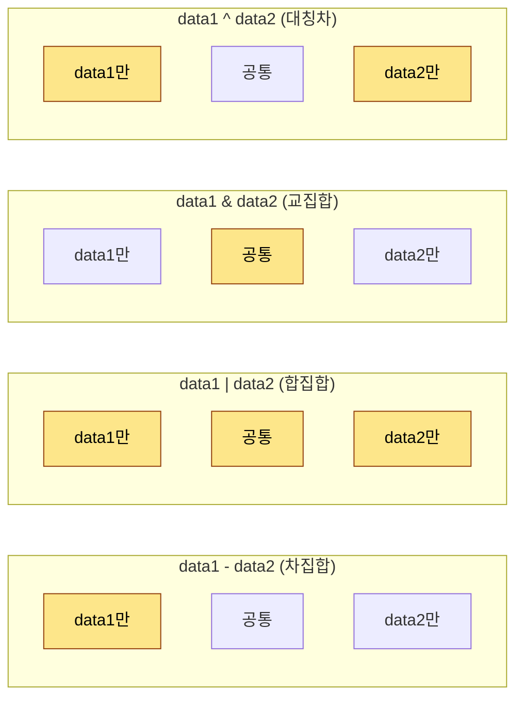
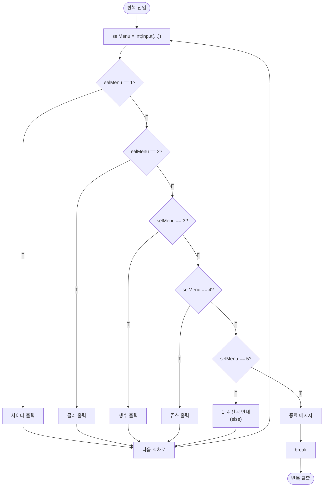
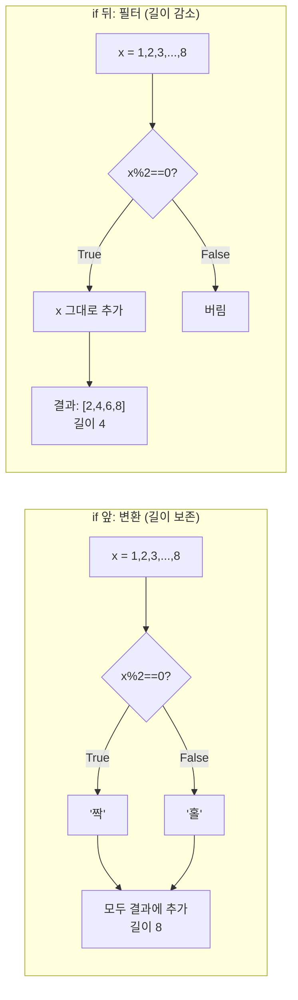
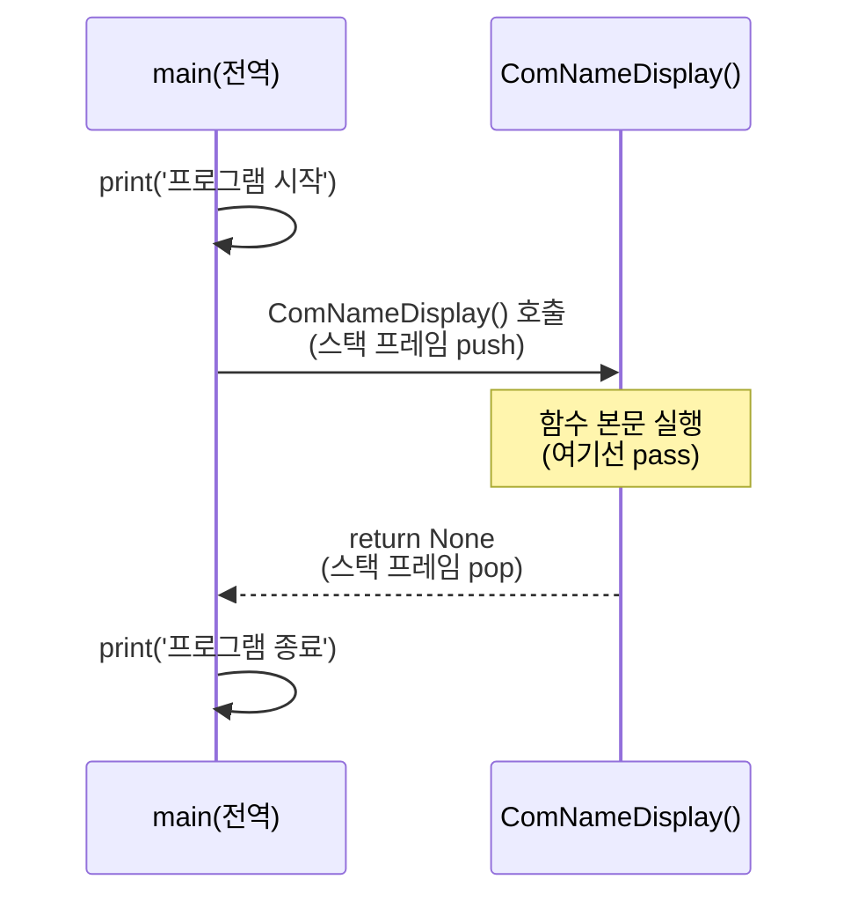
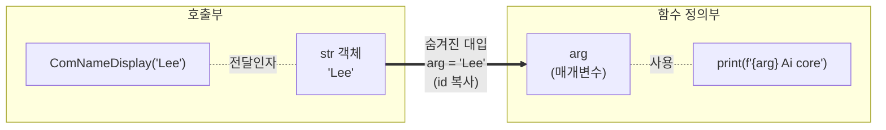

# 2026-05-20 파이썬 set·조건문·반복문·함수 복습 자료

> 수업 필기(`review.py`, `dict_in_get.py`, `set_exam1.py`, `if_exam1.py`, `conditionalExpression_exam.py`, `conditionalExpression_test.py`, `for_exam.py`, `for_test.py`, `function_exam.py`, `function_test1.py`)를 주제별로 재구성하고 설명을 덧붙였습니다.

---

## 0. 지난 시간 복습 — 시퀀스·튜플·딕셔너리

### 0-1. 시퀀스 타입의 큰 그림

- **시퀀스 타입**: 순서·인덱스가 있는 자료형 → `str`, `list`, `tuple`.
- 그중 가장 많이 쓰는 것은 **리스트(list)**.
- 객체 생성은 두 가지 표기 모두 가능 — 결과는 동일하다.

```python
listData = list()    # 클래스 호출 (객체지향 정식 표기)
listData = []        # 리터럴 (파이토닉)
```

- 변수는 **객체의 id(메모리 주소)** 만 담는다. 리스트는 그 안에 담긴 항목들의 id를 담는 그릇.
- 따라서 리스트 항목의 타입에는 **제한이 없다**.

```python
listdata = [[5, 6], "python", 3.14]   # 중첩 리스트 + 문자열 + 실수 모두 OK
print(listdata[1])                    # 'python' — 색인 연산
listdata[1] = "ai"                    # 리스트는 read/write 둘 다 가능
```

### 0-2. 튜플 — 읽기 전용 시퀀스

```python
tupleData = ()        # == tuple()
tupleData = (5,)      # ★ 항목이 1개일 땐 콤마 필수 — 없으면 (5)는 그냥 정수 5
```

- 튜플은 리스트와 같이 **항목 종류 제한 없음, 인덱스 사용 가능**.
- 그러나 **불변(immutable)**. 한 번 정해진 항목 id를 바꿀 수 없는 **상수 개념**.
- 변수가 바라보는 메모리 주소를 고정하는 것 → **read 전용** 시퀀스.

### 0-3. 튜플의 pack / unpack — 파이썬다운 swap

```python
data1, data2 = (3, 5)   # unpack
print(data1, data2)     # 3 5

a, b = 5, 7
a, b = b, a             # tmp 변수 없이 swap — 내부적으로 (b, a) 튜플로 pack 후 unpack
print(a, b)             # 7 5
```

- 우변이 먼저 **튜플로 pack** 되어 메모리에 임시 객체를 만든 뒤, 좌변에서 **unpack** 되어 대입된다.
- C 스타일 `tmp = a; a = b; b = tmp` 가 필요 없는 **가장 파이썬스러운 코드**.

**시각화** — pythonic swap vs C-style swap 비교:



### 0-4. numpy 짧은 복습

```python
import numpy as np   # 원칙: import는 파일 최상단에 모은다

arr1 = np.array([[[3, 4, 5, 6, 7], [4, 3, 3, 2, 5]]])
print(arr1.ndim)     # 차원 수
print(arr1.shape)    # 형태 (튜플 반환)

# 범위 데이터
print(np.arange(1, 11))                  # numpy 버전 range
arr2 = np.arange(1, 10).reshape(3, 3)    # 3행 3열로 reshape — 원소 개수가 맞아야 한다
```

- `reshape` 에 전달하는 형태는 원래 **튜플**이지만, 파이썬의 **unpack 기능** 덕에 `reshape(3, 3)` 처럼 풀어서 써도 된다.

### 0-5. 딕셔너리 — 매핑 타입

```python
dictData = {}                # == dict() — 시퀀스 타입 아님!
dictData["key"] = 'value'    # 대괄호 안은 인덱스가 아니라 key
dictData["key"] = 'value2'   # 같은 key면 value 갱신, 없으면 새로 생성

for key in dictData:         # dict를 for에 넘기면 key가 순회된다
    print(key, dictData[key])
```

- key 와 value 의 쌍을 묶는 **매핑 타입**. 순서가 없으므로 **인덱스로 접근하면 안 된다**.
- `for ... in dict` 는 **key 만** 돌아간다.

---

## 1. 딕셔너리 심화 — `in` 연산자와 `get`

### 1-1. `in` 연산자는 자료형마다 의미가 다르다

```python
print("py" in "python")     # True — 문자열의 부분 문자열 포함 검사
print('kor' in dictData)    # True/False — dict 에서는 'key가 있는지' 검사
```

- 같은 `in` 키워드라도 좌측 객체가 무엇이냐에 따라 동작이 달라진다.
- **dict 의 `in` 은 key 존재 여부**. value 까지 보지 않는다.

### 1-2. 없는 key 로 접근하면 프로그램이 죽는다

```python
dictData = {'kor': 90, 'eng': 70, 'math': 80}
# print(dictData['music'])   # KeyError → 프로그램 종료
```

- 그래서 보통 `if key in dict:` 로 먼저 확인하거나, `get` 을 쓴다.

### 1-3. `get` — 예외 없이 value 조회 ★ 매우 중요

```python
print(dictData.get('kor', None))     # 90       — 있으면 value 반환
print(dictData.get('music', None))   # None     — 없으면 두 번째 인자(default) 반환
```

- `dict.get(key, default)` 는 **존재하지 않는 key에 대해 예외 대신 default 를 반환**한다.
- 두 번째 인자를 생략하면 **None**. 그래도 **명시하는 습관을 들이자**.
- 입력값으로 dict 를 조회하는 모든 곳에서 단골로 쓰임.

**시각화** — `d[key]` vs `d.get(key, default)`:



```python
while True:
    inputData = input('과목을 입력: ')
    if dictData.get(inputData, None):    # 값이 있으면 truthy
        print(dictData[inputData])
    else:
        print('해당 과목은 없음!')
```

---

## 2. 집합(`set`) — 수학적 집합 연산

### 2-1. set 의 성격

- 수학의 **합·교·차·여(대칭차)** 집합 연산을 지원.
- **시퀀스 타입이 아니다** → 인덱스 접근 불가, 순서 없음.
- **중복 데이터를 허용하지 않는다** — 그래서 "중복 제거 용도"로도 쓴다.

### 2-2. 생성 문법 — `{}` 함정 주의

```python
set()      # 빈 set
{}         # ★ 빈 dict 다! 빈 set 이 아님
{50, 90, 60, 40}   # 항목이 있으면 set
```

```python
data1 = {50, 90, 60, 40}
print(data1, type(data1))   # {40, 50, 60, 90} <class 'set'>
```

### 2-3. 중복 제거 — list ↔ set 형 변환

```python
listData = [5, 4, 32, 4, 6, 2, 1, 2, 4, 4, 5, 6, 67, 1, 6, 5]
print(set(listData))           # {1, 2, 4, 5, 6, 32, 67} — unique 항목만
print(list(set(listData)))     # 다시 리스트로 되돌리기
```

- `set()` 으로 형 변환만 해도 자연스럽게 **중복이 제거**된다.

### 2-4. 집합 연산자 4종

```python
data1 = {50, 90, 60, 40}
data2 = {90, 60, 80, 30}

print(data1 - data2)   # 차집합: {40, 50}
print(data1 | data2)   # 합집합: {30, 40, 50, 60, 80, 90}
print(data1 & data2)   # 교집합: {60, 90}
print(data1 ^ data2)   # 대칭차(여): {30, 40, 50, 80}
```

| 연산자 | 의미 | 설명 |
|---|---|---|
| `-` | 차집합 | `data1` 에만 있는 항목 |
| `\|` | 합집합 | 두 집합 항목 모두 |
| `&` | 교집합 | 양쪽 모두에 있는 항목 |
| `^` | 대칭차 | 한쪽에만 있는 항목(공통 제외) |

**시각화** — 벤다이어그램으로 보는 4가지 연산:

```
        data1 = {50, 90, 60, 40}            data2 = {90, 60, 80, 30}

         ┌─────────────┐                     ┌─────────────┐
         │   data1     │                     │   data2     │
         │             │                     │             │
         │    50 40    │   ┌───────────┐    │   80 30     │
         │         ╲   │   │           │    │   ╱         │
         │          ╲  │   │  60  90   │    │  ╱          │
         │           ╲ │   │           │    │ ╱           │
         │            ╲┘   └───────────┘    └╱            │
         │              교집합 data1 & data2                │
         │                                                  │
         └──────────────────────────────────────────────────┘

   data1 - data2  : 왼쪽 영역만 → {40, 50}
   data1 | data2  : 전체 영역  → {30, 40, 50, 60, 80, 90}
   data1 & data2  : 가운데만   → {60, 90}
   data1 ^ data2  : 양 끝만(가운데 제외) → {30, 40, 50, 80}
```



(노란색이 연산 결과에 포함되는 영역)

### 2-5. 난수 — `random` 과 `numpy.random` 비교

```python
import random
result = random.randint(1_000_000, 2_000_000)   # a~b 사이 정수 하나 (한 번에 1개만)
print(result)
```

- 파이썬 기본 제공 `random.randint` 는 **한 번에 1개의 정수**만 뽑는다.

```python
import numpy as np

result2 = np.random.randint(1, 46, (6,))       # 1차원, 6개
print(set(result2))
print(list(set(result2)))                       # 중복 없는 로또 번호 만들기

result3 = np.random.randint(1, 46, (5, 6))     # 5행 6열 → 5개의 로또 게임
print(result3)
```

- `numpy.random.randint(low, high, size)` 는 **크기를 튜플로 지정**해 한 번에 여러 개 추출.
- 로또 번호처럼 "여러 개의 난수가 필요할 때" 는 numpy.

---

## 3. 조건문(`if` / `elif` / `else`)

### 3-1. 조건의 정체 — 표현식이 참/거짓을 만든다

- 조건문은 프로그램의 **흐름을 분기**시키는 구문(=분기문).
- 조건 자리에는 **참/거짓을 반환하는 표현식**이 온다.
- 그 표현식을 만드는 도구가 **연산자**.

| 분류 | 연산자 | 비고 |
|---|---|---|
| 비교(관계) | `>`, `<`, `>=`, `<=`, `==`, `!=` | 핵심 |
| 논리 | `and`, `or`, `not` | (다른 언어 `&&`, `\|\|` 와 동일 의미) |
| 비트 | `~`, `&`, `\|`, `^` | 거의 안 씀 |
| 사칙 | `+`, `-`, `*`, `/`, `%`(나머지), `//`(몫) | `%`, `//` 자주 등장 |

```python
print((5 == 3) and (3 > 1))   # False
print(5 % 7)                  # 5
print(5 > 3)                  # True
```

### 3-2. truthy / falsy — 0 이외의 수는 모두 참

```python
if 50:               # 0 이외의 모든 수는 참
    print('참')      # 출력됨
```

- 파이썬에서는 `0`, `''`, `[]`, `{}`, `None` 등이 **falsy**, 그 외는 **truthy**.
- 그래서 `if dict.get(key, None):` 같은 코드가 자연스럽게 동작한다.

### 3-3. 세 가지 if 형태

**① 단독 `if`**

```python
data = 5
if data == 5:
    print('data == 5')
```

**② `if-else`**

```python
if data == 5:
    print('data == 5')      # 조건이 참일 때
else:
    print('data != 5')      # 조건이 거짓일 때
```

**③ `if-elif-else`** — 경우의 수가 많을 때

```python
print('메뉴 : 1.사이다 2.콜라 3.생수 4.쥬스 5.프로그램 종료')
while True:
    selMenu = int(input('메뉴를 선택하세요.'))   # input()은 항상 문자열 반환 → 형 변환 필수
    if selMenu == 1:
        print('사이다를 선택하셨습니다.')
    elif selMenu == 2:
        print('콜라를 선택하셨습니다.')
    elif selMenu == 3:
        print('생수를 선택하셨습니다.')
    elif selMenu == 4:
        print('쥬스를 선택하셨습니다.')
    elif selMenu == 5:
        print('프로그램을 종료합니다.')
        break
    else:                                        # 조건은 if, elif 뒤에만! else에는 조건 없음
        print('1~4 중 메뉴 하나를 선택하셔야 합니다.')
```

- `else` 자리에는 조건을 적을 수 없다. **위 조건을 모두 만족하지 않을 때**의 분기.
- 파이썬에는 **`switch-case` 가 없다** — 그 자리를 `if-elif-else` 가 대신한다.

**시각화** — 메뉴 선택 코드의 분기 흐름:



핵심 — **`if` → `elif` 들 → `else`** 는 위에서 아래로 차례대로 검사되며, **하나라도 참이 나오면** 그 블록만 실행하고 나머지는 건너뜀.

---

## 4. 조건 표현식(삼항 연산자)

### 4-1. 한 줄짜리 if-else

```python
data1, data2 = 50, 90

# 일반 if-else
if data1 > data2:
    max = data1
else:
    max = data2

# 같은 의미의 조건 표현식 — 한 줄
max = data1 if (data1 > data2) else data2
```

- 패턴: **`값1 if 조건 else 값2`**.
- 간단한 분기를 줄여 쓸 때 매우 자주 쓰임.

### 4-2. 리스트 내포 + 조건 표현식

```python
listData = ['짝' if (x % 2 == 0) else '홀'  for x in range(1, 9)]
print(listData)   # ['홀', '짝', '홀', '짝', '홀', '짝', '홀', '짝']
```

- 각 항목을 만들 때 **조건 표현식**으로 값을 결정해서 새 리스트에 채운다.

### 4-3. 리스트 내포 + 필터(`if`) — 위치가 다르다!

```python
wordList = ['book', 'car', 'apple', 'python', 'ai']

# 길이가 4 이상인 단어만 새 리스트로
newWordList = [word for word in wordList if (len(word) >= 4)]
print(newWordList)   # ['book', 'apple', 'python']
```

| 형태 | 위치 | 역할 |
|---|---|---|
| `[값1 if 조건 else 값2 for x in iterable]` | **앞** | 항목 변환 (모든 항목 유지) |
| `[x for x in iterable if 조건]` | **뒤** | 항목 필터링 (조건 맞는 것만 통과) |

→ 같은 `if` 라도 **앞에 오면 표현식, 뒤에 오면 필터**.

**시각화** — 같은 `if`인데 위치만 다르면 결과가 완전히 달라진다:

```
입력: range(1, 9) = [1, 2, 3, 4, 5, 6, 7, 8]

──────────────────────────────────────────────────────────────
앞 (변환):  [ '짝' if x%2==0 else '홀'   for x in range(1,9) ]
              └─── 조건 표현식 ───┘     └─── 모든 x 통과 ───┘
          ┌────────────────────────────────────────────────┐
          │ x=1 → '홀'                                      │
          │ x=2 → '짝'   ← 8개 모두 결과 리스트에 들어감     │
          │ x=3 → '홀'                                      │
          │ ...                                             │
          └────────────────────────────────────────────────┘
          결과: ['홀','짝','홀','짝','홀','짝','홀','짝']  (길이 8)

──────────────────────────────────────────────────────────────
뒤 (필터):  [ x   for x in range(1,9)   if x%2==0 ]
              └값┘                       └─ 필터 ─┘
          ┌────────────────────────────────────────────────┐
          │ x=1 → 통과X                                     │
          │ x=2 → 통과 ✓  ← 조건 만족한 항목만 들어감       │
          │ x=3 → 통과X                                     │
          │ ...                                             │
          └────────────────────────────────────────────────┘
          결과: [2, 4, 6, 8]  (길이 4 — 줄어듦!)
```



### 4-4. 종합 예제 — 대문자 → 소문자 (메서드 없이)

```python
# ord(): 문자 → 아스키 코드,  chr(): 아스키 코드 → 문자
# 'A'~'Z' 의 아스키는 65~90, 'a'~'z' 는 97~122 → 차이가 32
srcString = 'PYTHON PROGRAMING'

listData = [chr(ord(x) + 32)
            if ((ord(x) >= 65) and (ord(x) <= 90))
            else x
            for x in srcString]

result = ''.join(listData)
print(result)   # 'python programing'
```

- 문자열의 `.lower()` 메서드를 쓰면 한 줄이지만, **리스트 내포 + 조건 표현식의 사고 훈련** 차원에서 직접 구현.

---

## 5. 반복문 — `for`

### 5-1. 기본 형태

```python
for x in [4, 5, 6]:
    print(x)
```

- `in` 뒤에는 **이터러블(iterable)** 한 것이면 무엇이든 — 리스트, 튜플, 문자열, range, dict, set 등.
- 항목이 하나씩 `x` 에 대입되어 블록이 반복 실행된다.

### 5-2. 누적 합계 — `range` 와 조합

```python
sum = 0
for x in range(1, 101):     # 1~100 (101 미포함)
    sum += x
print(sum)                  # 5050
```

### 5-3. 문자열 순회로 특정 문자 개수 세기

```python
myString = "Python Programming, Ai Agent Programming"
quantity = 0
for x in myString:
    if x == 'g':
        quantity += 1
print(quantity)
```

### 5-4. f-string 으로 구구단

```python
step = int(input('출력할 구구단 단수 입력: '))
for x in range(step + 1):     # 0 ~ step
    print(f'{step} * {x} = {step * x}')
```

- `f'{변수}'` — 문자열 안에 변수/식의 결과를 바로 끼워 넣는 **포맷 문자열**.

### 5-5. 딕셔너리 순회 — key/value 동시에 받기

```python
myDict = {'a': 1, 'b': 2, 'c': 3, 'd': 4}
newDict = {}

# 방법 ① dict 그대로 — key 만 순회
for key in myDict:
    newDict[myDict[key]] = key

# 방법 ② items() — (key, value) 튜플로 동시에 unpack
for key, value in myDict.items():
    newDict[value] = key

print(newDict)   # {1: 'a', 2: 'b', 3: 'c', 4: 'd'} — key/value 뒤집기
```

- `dict.items()` 는 `dict_items` 객체 — 각 항목이 `(key, value)` **튜플**.
- 그래서 `for key, value in ...` 으로 **자동 unpack** 이 된다.

### 5-6. 종합 예제 — 첫 글자별로 단어 묶기

```python
wordList = ['car', 'apple', 'cattle', 'bar', 'book', 'air', 'cat']

wordDict = {}
seen = set()        # 이미 등장한 첫 글자 추적

for item in wordList:
    first = item[0]
    if first not in seen:
        seen.add(first)
        wordDict[first] = [item]       # 새 key → 리스트 하나로 시작
    else:
        wordDict[first].append(item)   # 기존 key → 리스트에 덧붙임

print(wordDict)
# {'c': ['car', 'cattle', 'cat'], 'a': ['apple', 'air'], 'b': ['bar', 'book']}
```

- set 과 dict, list 를 **조합**해서 분류기를 만든 예제. set 의 `in` 으로 "처음 보는 글자인가?" 를 빠르게 확인.

> **TIP**: 위 패턴은 `dict.setdefault(first, []).append(item)` 또는 `collections.defaultdict(list)` 로 더 간결하게 쓸 수 있다 (나중에 학습).

---

## 6. 함수(`def`) — 코드 재활용의 핵심

### 6-1. 왜 함수인가

- **유지보수성** ↑, **재활용성** ↑.
- 특정 기능을 분할해서 **완성된 코드 블록**으로 만들어 두는 것.
- 수학의 `y = f(x)` — **입력(매개변수) → 처리 → 출력(반환값)** 이라는 추상.
- 입력이 없을 수도, 출력이 없을 수도 있다.

### 6-2. 정의(definition)와 호출(call)

```python
def ComNameDisplay():     # def 키워드로 시작 — 함수 정의
    pass                  # 일단 뼈대만. 비워두면 IndentationError, pass로 자리표시.

print('프로그램 시작')
ComNameDisplay()          # 함수명() — 함수 정의부로 점프!
print('프로그램 종료')
```

- **정의는 `def`, 호출은 함수명**.
- 함수 호출은 내부적으로 **stack** 으로 관리됨 — 호출 깊이가 깊어질수록 stack 사용량이 늘어난다.

**시각화** — 호출 시 제어 흐름과 콜 스택:



콜 스택의 변화:

```
시점 ①: main만 실행 중       시점 ②: 함수 호출 직후       시점 ③: 함수 return 후
                              ┌─────────────────┐
                              │ ComNameDisplay()│  ← push
   ┌─────────────────┐        ├─────────────────┤        ┌─────────────────┐
   │  main(전역)     │        │  main(전역)     │        │  main(전역)     │
   └─────────────────┘        └─────────────────┘        └─────────────────┘
   STACK BOTTOM ───────────────────────────────────────────────────────────►
```

### 6-3. 매개변수와 전달인자

```python
def ComNameDisplay(arg):              # arg: 매개변수(parameter)
    print(f'{arg} Ai core')

ComNameDisplay('Lee')                 # 'Lee': 전달인자(argument)
```

- 호출 시 **전달인자의 id 가 매개변수로 복사**된다.
- 전달인자와 매개변수 사이에는 **숨겨진 `=` 대입 연산자**가 있다고 생각하면 된다.

**시각화** — 전달인자 → 매개변수 = 숨겨진 대입:



### 6-4. 매개변수 다중화 + 반환값

```python
def ComNameDisplay(arg1, arg2):
    return f'{arg1} {arg2} Ai core'   # return: 종료 + 값 반환

result = ComNameDisplay('Lee', 80)
print(result)
```

- `return` 은 두 가지 일을 한다 — **함수 종료**, **값 반환**.
- `return` 이 없으면 파이썬은 **None 객체를 반환**한다 (오류가 아니다 — `sort()` 가 None 반환하던 그것).

### 6-5. 매개변수 없이, 반환만 — 입력 함수

```python
def InputData():
    numData = int(input('정수 하나 입력하세요'))
    return numData

data1 = InputData()                   # 반환값을 변수로 받지 않으면 GC 대상이 된다
print("data1:", data1)
```

- **변수 scope**: 함수 안에서 만든 변수는 **함수 안에서만 유효**(지역 변수).
- 외부에서 그 값을 쓰려면 **반환값을 받아둘 변수**가 필요하다.

### 6-6. 리스트를 받는 함수 — 합계, 더하기

```python
def listSumOfData(arr):
    sum = 0
    for num in arr:
        sum += num
    return sum

def addListData(arr1, arr2):
    result = []
    for i in range(len(arr1)):        # enumerate(arr1) 로도 가능
        result.append(arr1[i] + arr2[i])
    return result

print(listSumOfData([60, 77, 88, 33]))         # 258
print(addListData([5, 6, 7, 8], [2, 3, 4, 5])) # [7, 9, 11, 13]
```

### 6-7. 가변 인자 `*args` — 튜플로 받는다

```python
def function(*arg):                   # 별표 1개 → 여러 인자를 튜플로 묶어 받음
    print(arg, type(arg))             # (1, 3, 4, 5, 6, 6) <class 'tuple'>

function(1, 3, 4, 5, 6, 6)
```

- 호출 시 전달한 모든 위치 인자가 **하나의 튜플**로 패킹되어 들어온다.
- 인자의 **개수가 가변**일 때 쓰는 표기.

### 6-8. `enumerate` 와 무시 변수 `_`

```python
def CheckAlphaData(_str, alpha):
    count = 0
    for _, s in enumerate(_str):      # 인덱스는 안 쓰니 '_' 로 무시
        if s == alpha:
            count += 1
    return count

cnt = CheckAlphaData('python programming', 'p')
print('cnt:', cnt)                    # 2
```

- `enumerate(iterable)` 은 **(index, value)** 튜플을 만들어 준다.
- 두 값 중 하나가 필요 없을 땐 **관례적으로 `_`** 로 받는다 ("쓰지 않을 변수").
- ※ 위 코드는 사실 `for s in _str:` 로 충분하지만, **`enumerate` + `_` 패턴 학습용** 예제.

### 6-9. 좋은 함수 작성 습관

- 정의와 호출은 **분리**한다 — 한 파일에서 분리하거나, 정의는 다른 파일에 두고 `import` 해서 호출.
- 함수 안에서는 **외부 변수에 의존하지 말고**, 필요한 값은 **매개변수로 받기**, 결과는 **return 으로 반환**.
- 한 함수는 **한 가지 일**만 — 너무 많은 책임을 지지 않도록.

---

## 7. 오늘의 핵심 한눈에

| 주제 | 핵심 키워드 |
|---|---|
| 시퀀스 복습 | list/tuple/str — 인덱스, 슬라이싱 / 튜플은 read 전용 |
| 튜플 활용 | `a, b = b, a` — pack/unpack 으로 파이썬다운 swap |
| dict 안전 조회 | `in`, `.get(key, default)` ★ |
| set | 중복 제거 + 집합 연산 `-`, `\|`, `&`, `^` |
| 난수 | `random.randint`(1개) vs `np.random.randint`(여러 개) |
| 조건문 | `if-elif-else`, truthy/falsy, switch-case 없음 |
| 조건 표현식 | `값1 if 조건 else 값2`, 리스트 내포의 **앞=변환, 뒤=필터** |
| for | `range`, 문자열/딕셔너리/리스트 순회, `dict.items()` |
| 함수 | `def`, 매개변수/전달인자, `return`, `*args`, `enumerate` + `_` |

> 다음 단계: 함수의 키워드 인자, `**kwargs`, 기본값, 모듈 분리 / 클래스 정의.
