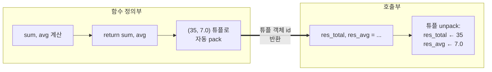
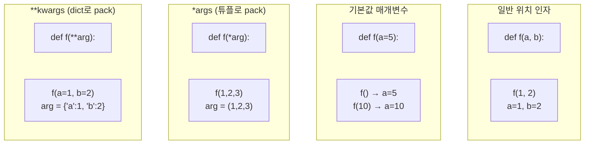
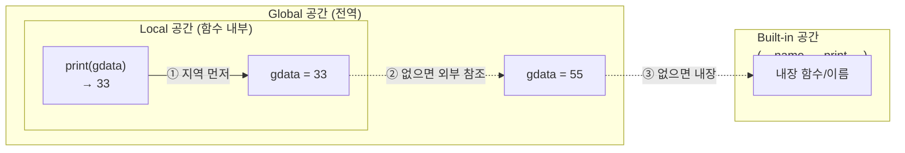
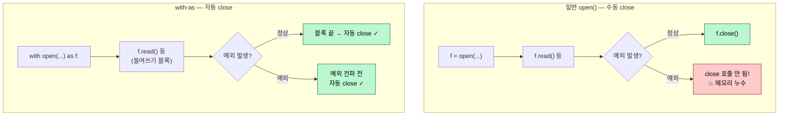

# 2026-05-21 파이썬 함수 심화·스코프·파일 입출력 복습 자료

> 수업 필기(`review.py`, `function_exam1.py`, `function_exam2.py`, `function_exam3.py`, `function_test1.py`, `function_test2.py`, `file_exam1.py`, `file_exam2.py`, `file_exam3.py`, `file_test1.py`)를 주제별로 재구성하고 설명을 덧붙였습니다.

---

## 0. 지난 시간 복습 — 함수의 기본

### 0-1. 왜 함수인가

- 코드의 양이 커지고 큰 프로젝트가 되면 **기능 단위로 분할**해서 함수화시켜야 한다.
- 함수는 두 종류로 나뉜다.
  - **라이브러리 함수**: `print`, `input` 등 이미 만들어진 함수를 호출만 한다.
  - **사용자 정의 함수**: 직접 `def` 로 정의부까지 구현해야 한다.
- 함수 호출 시 흐름은 **호출부 → 정의부로 점프 → 모든 명령 실행 후 호출부로 복귀**.

### 0-2. 기본 문법

```python
def 함수명(매개변수):
    # 기능 서술
    pass        # 미정의 오류 escape (자리표시)
```

### 0-3. 다중 반환값 — 튜플 pack/unpack

```python
def addDataFunction(arg):
    sum = 0
    for i in arg:
        sum += i
    avg = sum / len(arg)
    return sum, avg                # 여러 값 → 튜플로 자동 pack 되어 반환

res_total, res_avg = addDataFunction([5, 6, 7, 8, 9])   # 자동 unpack
print('res_total:', res_total)     # 35
print('res_avg:', res_avg)         # 7.0
```

- `return a, b` 처럼 쉼표로 여러 값을 나열하면 **튜플로 묶여 반환**.
- 호출부에서 변수 두 개로 받으면 **unpack** 되어 각각 들어간다.
- 어제 배운 `a, b = b, a` swap 과 동일한 메커니즘.

**시각화** — 다중 반환의 pack/unpack:



---

## 1. 매개변수 심화 — 기본값·가변·키워드 인자

### 1-1. 기본값 매개변수(default parameter)

```python
def SumOfIntData(arg=5, _=10):     # arg=5, _=10 이 기본값
    total = 0
    for i in range(arg):
        total += i
    return total

result = SumOfIntData(50)          # arg=50, _=10(기본값 그대로 사용)
```

- 정의부에서 매개변수에 `=` 로 값을 주면 **기본값**이 된다.
- 호출 시 인자를 생략하면 그 기본값으로 동작.
- **주의**: 인자는 **인덱스 기반**으로 매핑된다. 앞에 기본값이 있다고 다음 매개변수에 자동으로 들어가지 않는다.

### 1-2. 가변 매개변수 `*args` — 튜플로 pack

```python
def SumOfData(_arg, *arg):         # *를 붙이면 여러 인자를 하나로 pack
    print(arg, type(arg))          # (5, 6, 7, 8, 9) <class 'tuple'>

SumOfData(3, 5, 6, 7, 8, 9)        # _arg=3, arg=(5,6,7,8,9)
```

- 정의부에 `*매개변수` → 호출부의 **나머지 위치 인자들이 하나의 튜플로 묶여** 전달된다.
- 매개변수를 더 늘려도 `*` 가 모두 흡수해 버린다.

### 1-3. 키워드 가변 매개변수 `**kwargs` — dict로 pack

```python
def MyDictFunc(**arg):             # **를 붙이면 dict로 pack
    print(arg.keys(), arg.values(), type(arg))

MyDictFunc(a=100, b=30, c=90)      # arg = {'a':100, 'b':30, 'c':90}
```

- 정의부에 `**매개변수` → 호출부의 **`key=value` 형식 인자들이 dict로 묶여** 전달된다.
- `*` 는 튜플로, `**` 는 dict로 묶는다.

**시각화** — 매개변수 4가지 형태 비교:



| 표기 | pack 결과 | 받을 수 있는 호출 |
|---|---|---|
| `arg` | 객체 1개 | `f(10)` |
| `arg=5` | 객체 1개 (기본값 5) | `f()`, `f(10)` |
| `*arg` | **튜플** | `f(1, 2, 3, ...)` (위치 인자 여러 개) |
| `**arg` | **dict** | `f(a=1, b=2, ...)` (키워드 인자 여러 개) |

### 1-4. 튜플 리스트 순회 — `for i, v in arg:`

```python
def MyDataControll(arg):
    result = 0
    for i, v in arg:               # 각 항목이 튜플이라 unpack 가능
        result += v
    return result

dataList = [(3, 4), (5, 6), (7, 5)]
result = MyDataControll(dataList)  # 4 + 6 + 5 = 15
```

- 리스트의 각 항목이 **(a, b) 형태 튜플** 이면 `for a, b in list:` 로 바로 unpack.
- 어제 배운 `dict.items()` 순회와 같은 패턴.

---

## 2. 함수의 스코프(Scope) — 변수가 사는 공간

### 2-1. 스코프란

- 하나의 변수가 **어디부터 어디까지 사용될 수 있는가** 의 범위.
- 파이썬에서는 변수 "선언" 이 곧 **등록(register)** 개념으로 쓰인다.
- 함수 내부에서 같은 이름의 변수를 써도 문제는 없지만 **가독성이 떨어지므로 피한다**.

### 2-2. 전역 vs 지역 — 우선순위와 참조 방향

```python
gdata = 55                         # 전역공간 등록

def DisplayData():
    # print(gdata)                 # 함수 내부에 없으면 외부 스코프(전역)를 참조 → 55
    gdata = 33                     # ★ 함수 내부에 새로 등록 → 지역변수
    print(gdata)                   # 33 (지역공간 우선)
    print(locals())                # {'gdata': 33}

DisplayData()
print(gdata)                       # 55 (전역은 그대로!)
```

- **함수 내부 스코프 → 외부 스코프** 의 단방향 참조.
- 같은 이름이면 **지역공간을 우선**해서 사용한다.
- `locals()` — 현재 스코프에 등록된 변수 dict 확인.

**시각화** — 스코프 참조 방향(LEGB 단방향):



```
┌──────────────────────────────────────────────────────┐
│   Built-in 공간 (print, input, len, ...)             │
│  ┌───────────────────────────────────────────────┐   │
│  │   Global 공간 (gdata = 55)                    │   │
│  │  ┌──────────────────────────────────────┐    │   │
│  │  │   Local 공간 (gdata = 33)            │    │   │
│  │  │                                       │    │   │
│  │  │   print(gdata) → 33 ← 자기 공간 우선  │    │   │
│  │  └──────────────────────────────────────┘    │   │
│  │   참조 방향: Local → Global → Built-in        │   │
│  │            (안 → 밖, 한쪽만 가능)              │   │
│  └───────────────────────────────────────────────┘   │
└──────────────────────────────────────────────────────┘
```

### 2-3. `global` 키워드 — 전역 변수를 함수에서 수정

```python
def DataControl():
    # gdata += 50                  # ★ UnboundLocalError! 지역에 없는데 더하기 시도
    global gdata                   # "전역공간의 gdata 를 가져다 쓰겠다"
    gdata = 80                     # 이제 전역값이 바뀐다
    print(locals())                # {} — 지역에는 안 만들어짐
    print('gdata:', gdata)         # 80

gdata = 30
DataControl()
print('gdata:', gdata)             # 80 ← 전역값이 바뀜!
```

- 함수 내부에서 **전역 변수를 수정**하려면 `global 변수명` 선언이 필요하다.
- 선언 후엔 지역공간에 새로 등록하지 않고 **전역공간의 변수를 직접 가리킨다**.

### 2-4. 전역 변수 수정의 두 가지 방법

| 방법 | 특징 |
|---|---|
| **① `return` 활용** | 함수가 결과만 돌려주고, 호출부에서 전역변수에 대입 (권장 — 깔끔) |
| **② `global` 키워드** | 함수가 내부에서 직접 전역변수를 바꿈 (편하지만 추적이 어려워짐) |

```python
# ① return 활용
data = 50
value = 70

def ReverseData():
    return 70, 50

data, value = ReverseData()        # 호출부에서 unpack 대입

# ② global 키워드
data = 50
value = 70

def ReverseData():
    global data, value             # 두 변수를 전역공간에서 채용
    data, value = value, data

ReverseData()                      # 함수 호출만으로 전역값 바뀜
```

- 가능하면 **`return`** 방식을 선호하라 — 부작용(side effect)이 적고 디버깅이 쉽다.
- `global` 은 꼭 필요할 때만.

---

## 3. 함수 종합 예제

### 3-1. 영문자만 추출 — 비교 연산자로 직접 판별

```python
strData = '# AI % 3 pro&*graM'

def AlphaFindFunc(str):
    string = ''                    # 리스트로 모은 뒤 ''.join 하는 방법도 있음
    for s in str:
        if ((s <= 'Z') and (s >= 'A')) or ((s <= 'z') and (s >= 'a')):
            string += s
    return string

result = AlphaFindFunc(strData)    # 'AiprograM'
```

- 문자도 **비교 연산자**로 직접 범위 검사 가능. `ord()` 를 쓸 필요 없음.
- `'a' < 'b'` 는 내부적으로 아스키 값 비교.

### 3-2. key/value 두 리스트로 dict 만들기 — dict comprehension

```python
key_list = ['name', 'age', 'address']
value_list = ['hong', 50, 'seoul']

def InfoCombine(keys, values):
    # for 루프 버전
    # combDict = {}
    # for i, v in enumerate(keys):
    #     combDict[v] = values[i]
    # 컴프리헨션 버전 (파이토닉)
    combDict = {v: values[i] for i, v in enumerate(keys)}
    return combDict

result = InfoCombine(key_list, value_list)
# {'name':'hong', 'age':50, 'address':'seoul'}
```

- **dict comprehension**: `{ key표현식 : value표현식 for ... in ... }`
- 어제 배운 list comprehension 과 형제 격. `[]` 대신 `{}`, 그리고 `key : value` 형태.

### 3-3. dict 뒤집기 — 암호화/복호화 코드북

```python
EncBook = {
    'l': '#', 'p': '@', 'o': '7', 'g': '$', 'I': '%',
    'a': '8', 't': '*', 'r': '3', 'n': '6'
}

# 키/값 뒤집기 — 복호화 코드북 만들기
DecBook = {v: k for k, v in EncBook.items()}
# {'#':'l', '@':'p', '7':'o', '$':'g', '%':'I', ...}
```

- `dict.items()` 가 `(key, value)` 튜플을 반환 → `for k, v in ...` 로 unpack.
- 새 dict 에서 **value 를 key 로, key 를 value 로** 자리 바꿔 넣으면 역방향 매핑 완성.

자주 하는 실수 두 가지:

```python
# ❌ dict comprehension 안에서 할당문 사용
{DecBook[v] = k for k, v in EncBook.items()}    # SyntaxError

# ❌ .items() 빠짐 → dict를 그냥 순회하면 key만 나옴
{v: k for k, v in EncBook}                       # ValueError: too many values to unpack
```

→ 올바른 형태는 **`{v: k for k, v in EncBook.items()}`**.

### 3-4. 암호화/복호화 함수

```python
def EncryptFunc(msg):
    global EncBook
    for s in msg:
        if s in EncBook:
            msg = msg.replace(s, EncBook[s])
    return msg

def decryptFunc(msg):
    global DecBook
    for s in msg:
        if s in DecBook:
            msg = msg.replace(s, DecBook[s])
    return msg

StringData = 'I love AI python programming'
encmsg = EncryptFunc(StringData)   # 암호화
decmsg = decryptFunc(encmsg)       # 복호화 → 원본 복구
```

- `str.replace(old, new)` — 새 문자열을 **반환**(불변이므로 원본 안 바뀜). 다시 변수에 받아야 한다.
- 코드북(dict)을 이용한 1:1 치환 암호.

---

## 4. 파일 입출력(File I/O) — `open` / `close`

### 4-1. 큰 그림

- 파이썬의 파일 입출력 = **파일을 객체화해서 접근**, 그 객체를 통해 읽기/쓰기.
- `.txt` 같은 단순 텍스트는 **파일 입출력**이 최적.
- `xlsx`, `csv` 같은 복잡한 포맷은 **pandas** 같은 라이브러리가 더 편하다 (csv 도 텍스트이지만).
- 흐름: **앱 → OS 명령 → 펌웨어 → 하드디스크**. 그래서 라이브러리(open 등)를 사용해야 함.

### 4-2. 기본 사용 — `open()` / `close()`

```python
f = open('파일경로', '모드')        # 파일 객체와 연결
# ... 읽기/쓰기 ...
f.close()                          # 파일 객체 해제 — 잊지 말 것!
```

| 모드 | 의미 | 파일 없을 때 |
|---|---|---|
| `'r'` | 읽기 | 오류 |
| `'w'` | 쓰기 (**기존 내용 덮어씀**) | 새로 생성 |
| `'a'` | 추가 (append) | 새로 생성 |
| `'r+'` | 읽기 + 쓰기 | 오류 |

```python
f = open('myText', 'w')
f.write('no way!!')                # 기존 내용이 있으면 ★ 덮어쓰기 (주의!)
f.close()
```

- `'w'` 는 **무조건 새로 시작**. 기존 내용은 사라진다.
- `close()` 를 호출하지 않으면 실제로 디스크에 반영이 안 되거나 메모리 누수 발생.

### 4-3. 읽기 메서드 3가지

```python
f = open('./pythonData.txt', 'r')

strData = f.read()                 # 전체를 하나의 문자열로 읽기
strData = f.readline()             # 한 줄만 읽기 (첫 줄)
strData = f.readlines()            # 각 줄을 리스트의 항목으로 → ['line1\n', 'line2\n', ...]
```

| 메서드 | 반환 타입 | 동작 |
|---|---|---|
| `read()` | `str` | 파일 전체를 하나의 문자열로 |
| `readline()` | `str` | 현재 줄 하나만 (포인터 기준) |
| `readlines()` | `list[str]` | 각 줄을 항목으로 갖는 리스트 |

### 4-4. 파일 포인터(File Pointer) — `tell()` / `seek()`

```python
f = open('./pythonData.txt', 'r')

print('읽기 전,', f.tell())        # 0 (파일 시작)
strData = f.read()                 # 전부 읽어버림 → 포인터가 끝으로 이동
print('read(),', f.tell())         # 파일 크기와 같은 값
strData = f.readlines()            # 더 읽을 게 없음 → []
print(strData)                     # []

f.seek(0, 0)                       # 포인터를 맨 앞으로 되돌리기
print('seek(0,0),', f.tell())      # 0
strData = f.readlines()            # 이제 다시 읽힘
```

- 파일 객체는 **현재 위치(포인터)** 를 가지고 있다.
- 한 번 `read()` 로 다 읽으면 포인터가 끝으로 가서 더 읽을 게 없다.
- `seek(offset, whence)` 로 포인터 위치 이동 — `(0, 0)` 은 처음으로.

**시각화** — 파일 포인터의 이동:

```
파일 내용:  | p | y | t | h | o | n | \n | s | t | u | d | y | EOF
포인터 위치: 0   1   2   3   4   5   6    7   8   9  10  11  12

① open() 직후:           f.tell() == 0   →  ▼
                                            | p y t h o n \n s t u d y |
② f.read() 후:           f.tell() == 12  →                          ▼
                                            | p y t h o n \n s t u d y |
③ f.readlines() 호출:    더 읽을 게 없음 → []
④ f.seek(0, 0):          f.tell() == 0   →  ▼
                                            | p y t h o n \n s t u d y |
   다시 readlines() OK
```

### 4-5. `r+` 모드 — 읽고 쓰기 둘 다

```python
f = open('./pythonData.txt', 'r+', -1, 'utf-8')   # encoding='utf-8' 지정
strData = f.read()
print('strData:', strData)
f.write('\n가나다라')               # 현재 포인터 위치(끝)에 추가
f.seek(0, 0)
strData = f.readlines()
f.close()                          # ★ 닫는 것 잊지 말기 (메모리 누수 방지)
```

- 한글 파일을 다룰 때는 **`encoding='utf-8'`** 을 명시하는 습관을 들이자.
- 프로그램 종료 시 자동 해제되긴 하지만, **장시간 실행되는 프로그램은 메모리 누수**가 발생할 수 있다.

---

## 5. `with ... as` — 자동 close ★ 권장 패턴

### 5-1. 들여쓰기를 벗어나면 자동 close

```python
with open('pythonData.txt', 'r+') as f:
    # 이 indent 안에서만 f가 유효
    str = f.readlines()             # 전체를 리스트로 읽기
# indent 벗어나면 f.close() 자동 호출됨

# print(str)                        # 문자열은 메모리에 남아 있다 (파일 객체와 구분!)
# f.readlines()                     # ValueError: I/O operation on closed file
```

- `with open(...) as f:` 의 indent 블록을 벗어나면 **자동으로 `f.close()`** 호출.
- 예외가 발생해도 안전하게 닫힌다 → **권장 패턴**.
- **읽어 둔 데이터(`str`)** 와 **파일 객체(`f`)** 는 별개. 데이터는 메모리에 그대로 남는다.

**시각화** — 일반 open vs with-as:



### 5-2. 줄 단위 후처리 — `strip()`

```python
with open('pythonData.txt', 'r+') as f:
    str = f.readlines()             # ['python\n', 'stydy\n', 'ai\n', ...]

strList = [x.strip() for x in str]  # 각 줄의 양 끝 공백/개행 제거
# ['python', 'stydy', 'ai', 'programming', 'happy']
```

- `readlines()` 결과는 줄 끝에 `'\n'` 이 붙어 있다.
- `str.strip()` 으로 **양 끝 공백·개행·탭** 을 한 번에 제거 → 깔끔한 리스트.

### 5-3. 쉼표 구분 텍스트 → 리스트

```python
# 파일 내용: "python, test,programming, study, good"
with open('file_test.txt', 'r') as f:
    str = f.readline()

strList = [x.strip() for x in str.split(',')]
# ['python', 'test', 'programming', 'study', 'good']
```

- `split(',')` 로 쉼표 단위로 자르고, 각 토큰의 양 끝 공백을 `strip()` 으로 제거.
- 이 패턴은 CSV 파싱 직전 단계까지 자주 등장.

### 5-4. 특정 문자 개수 세기

```python
with open('setup.log', 'r') as log:
    str = log.read()

def FindCharFunc(str, char):
    num = 0
    for s in str:
        if s == 'R':                # ※ 매개변수 char 와 비교하도록 일반화 가능
            num += 1
    return num

result = FindCharFunc(str, 'R')
```

- 파일 전체를 문자열로 읽고 한 글자씩 순회하며 카운트.
- 어제 배운 **for + if 카운트 패턴**의 응용.

---

## 6. CSV 다루기 — pandas

### 6-1. `pandas` 로 CSV 읽기

```python
import pandas as pd

data = pd.read_csv('Health_info.csv')
print(data)                        # 2차원 표(DataFrame)로 반환
print(data.info())                 # 컬럼/타입/결측치 요약
```

- CSV(`Comma-Separated Values`) = **쉼표로 구분된 텍스트 파일**.
- `open()` + `split(',')` 로도 읽을 수 있지만, 컬럼/타입/결측 처리까지 해주는 **pandas** 가 훨씬 편하다.
- 반환값은 **DataFrame** — 행/열로 된 2차원 표.

### 6-2. 컬럼 선택과 기초 통계

```python
print(data['Weight'])              # 'Weight' 컬럼 한 줄(Series)로 추출
print(data['Weight'].mean())       # 평균
```

| 메서드 | 의미 |
|---|---|
| `data[컬럼명]` | 그 컬럼만 Series 로 추출 |
| `.mean()` | 평균 |
| `.sum()`, `.min()`, `.max()`, `.std()` | 합/최소/최대/표준편차 |
| `.info()` | 컬럼 정보 요약 |
| `.head(n)` | 앞 n 행 |

> 다음 단계에서는 조건 필터링(`data[data['Weight'] > 70]`)과 그룹별 통계(`groupby`) 를 배우게 됨.

### 6-3. `random.choice` — 리스트에서 무작위로 하나 뽑기

```python
import random
listdata = ['감자', '양파', '대파', '당근', '피망']
print(random.choice(listdata))     # 매 실행마다 다른 항목 출력
```

- 어제 배운 `random.randint`(정수 하나) 와 짝꿍.
- `random.choice(iterable)` — **시퀀스에서 무작위 항목 하나** 를 반환.

---

## 7. PyInstaller — `.py` 를 `.exe` 로 묶기

수업 끝물에 잠깐 다룬 배포 도구.

```bash
# venv(가상환경) 안에서 설치
pip install pyInstaller

# 빌드 대상 폴더로 이동
cd c:\Users\25\Documents\github\python_project\src\20260519

# 빌드 명령
python -m PyInstaller -w -F GUI_exam.py
```

| 옵션 | 의미 |
|---|---|
| `-w` (`--windowed`) | 콘솔 창을 띄우지 않는다 (GUI 앱용) |
| `-F` (`--onefile`) | 결과를 **하나의 `.exe` 파일** 로 묶는다 |

- 빌드가 끝나면 `dist/` 폴더에 `GUI_exam.exe` 가 생성됨.
- 처음 실행이 약간 느릴 수 있다 (압축된 모듈을 풀어내는 시간).
- `.spec` 파일은 빌드 설정을 담은 자동 생성 파일.

---

## 8. 오늘의 핵심 한눈에

| 주제 | 핵심 키워드 |
|---|---|
| 함수 복습 | `def`, 호출→점프→복귀, 다중 반환 (튜플 pack/unpack) |
| 매개변수 종류 | 기본값, `*args`(튜플), `**kwargs`(dict) |
| 스코프 | Local → Global → Built-in (단방향), `locals()` |
| 전역값 수정 | **① `return` 권장**, ② `global` 키워드 |
| dict comprehension | `{v: k for k, v in d.items()}` — key/value 뒤집기 |
| 파일 입출력 | `open(path, mode)` / `close()`, `r`/`w`/`a`/`r+` |
| 읽기 메서드 | `read`(전체), `readline`(한 줄), `readlines`(리스트) |
| 포인터 제어 | `tell()`, `seek(0, 0)` |
| 자동 close | **`with open(...) as f:`** ★ 권장 패턴 |
| 텍스트 가공 | `.strip()`, `.split(',')`, comprehension 조합 |
| CSV | `pandas.read_csv` → DataFrame, `df['col'].mean()` |
| 난수 | `random.choice(list)` — 항목 무작위 추출 |
| 배포 | `PyInstaller -w -F` → 단일 `.exe` |

> 다음 단계: 함수 모듈화(import 분리), 예외 처리(`try-except`), 클래스 정의, pandas DataFrame 심화.
