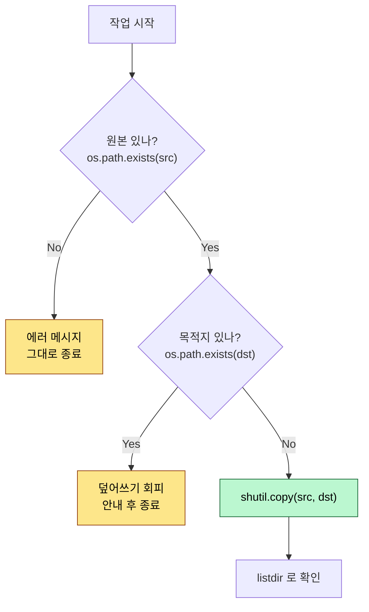
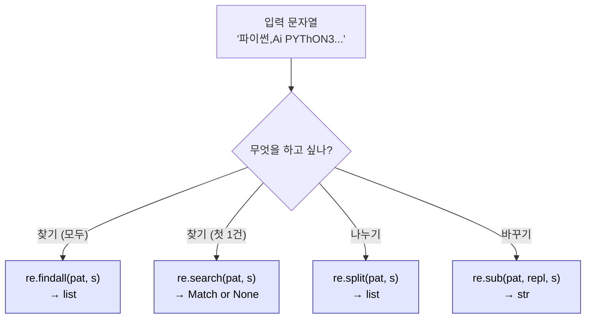
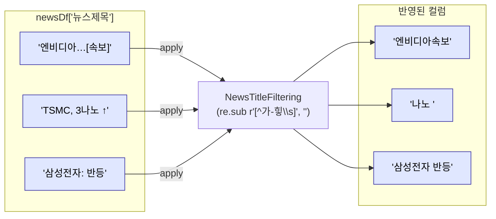

# 2026-05-22 디렉토리/파일 조작·정규표현식·웹 크롤링 복습 자료

> 수업 필기(`review.py`, `directory_exam1.py`, `directory_exam2.py`, `regular_expression_test.py`, `regular_expression1.py`, `regular_expression2.py`, `crawling_Naver_news1.py`, `crawling_Naver_news2.py`, `crawling_Naver_news3.py`, `crawling_YR.py`)를 주제별로 재구성하고 설명을 덧붙였습니다.

---

## 0. 지난 시간 복습 — 파일 입출력 & 포인터

### 0-1. `with open(...) as` + 포인터 이동

```python
with open("C:/sua/python_basic/20260521/pythondata.txt", "r+") as f:
    str = f.read()        # 전체 읽음 → 포인터가 끝으로 이동
    f.seek(0, 0)          # 포인터를 처음으로 되돌리기
    str2 = f.readlines()  # 다시 처음부터 줄 단위로 읽기
```

- `open()` 의 기본 모드는 `'r'`. **모드는 항상 명시**하는 습관을 들이자.
- 윈도우 경로의 `\` 는 이스케이프 문자로 인식되니 **`/` 로 바꿔주거나 `r"..."` raw string** 을 사용한다.
- `r+` 모드에서 `write()` 는 **커서 위치에 삽입(=덮어쓰기 효과)** 이므로 항상 `seek()` 으로 위치를 확인.

### 0-2. 키워드 인자로 호출 — 순서 무관

```python
with open(mode="r+", file="C:/.../pythondata.txt") as f:  # 키워드로 주면 순서 자유
    ...
```

- 위치 인자는 정의 순서에 묶이지만, **키워드 인자**(`이름=값`)로 주면 순서 무관.

### 0-3. 줄 끝 개행 제거 + DataFrame 으로

```python
listdata = [x.strip() for x in str2]   # ['python', 'study', 'Ai', ...]

import pandas as pd
mydf = pd.DataFrame(listdata)
mydf.to_excel("pythondata.xlsx", index=False)  # index 열 빼고 저장
```

- `readlines()` 결과의 `'\n'` 은 `strip()` 으로 제거.
- `pd.DataFrame(리스트)` 로 단일 컬럼 DF 생성 → `to_excel(..., index=False)` 로 깔끔한 엑셀 출력.

---

## 1. 디렉토리/파일 조작 — `os`, `shutil`

### 1-1. 왜 `os` 와 `shutil` 인가

- `os` — 파일/디렉토리의 **존재 확인, 생성, 삭제, 경로 조회**.
- `shutil` — 파일/디렉토리의 **복사·이동·재귀 삭제** 등 고수준 작업.
- ⚠️ **`os` 와 `sys` 는 조작에 주의** — path 가 날아가거나 시스템 영향이 큰 명령이 많음. `sys` 가 더 위험.

### 1-2. 현재 작업 경로 — `os.getcwd()`

```python
import os
print(os.getcwd())                 # C:\Users\25\Documents\github\python_project
root_dir = os.getcwd() + '\\'      # 매번 앞에 붙이기 귀찮으면 상수처럼 보관
```

- `getcwd` = **get current working directory**.
- 윈도우에서 경로 끝에 `\\` 한 번 더 붙여두면 `root_dir + 파일명` 으로 바로 이어 쓰기 편함.

### 1-3. 디렉토리/파일 존재 확인 & 생성

```python
if os.path.exists(root_dir + 'pythonDataset'):
    pass                           # 이미 있으면 그냥 두기
else:
    os.mkdir(root_dir + 'pythonDataset')   # 없으면 생성

print(os.listdir())                # 현재 위치의 파일/폴더 목록 (Linux의 `ls`, 윈도우의 `dir`)
```

| 함수 | 동작 | 주의 |
|---|---|---|
| `os.path.exists(path)` | 존재하면 `True` | 파일/디렉토리 모두 검사 |
| `os.mkdir(path)` | 디렉토리 1개 생성 | **이미 있으면 에러** → `if` 로 가드 |
| `os.makedirs(path)` | **중간 경로까지** 한 번에 생성 | 깊은 경로 만들 때 |
| `os.listdir(path)` | 디렉토리 내용 리스트 | 파일/폴더 이름만 반환 |

### 1-4. 삭제 — `os.rmdir` vs `shutil.rmtree`

```python
# os.rmdir(root_dir + 'dataset')   # 디렉토리에 파일이 하나라도 있으면 OSError
shutil.rmtree(root_dir + 'dataset')  # 내용물까지 싹 삭제 (강력 + 위험)
```

| 함수 | 동작 | 비고 |
|---|---|---|
| `os.rmdir(path)` | **빈** 디렉토리만 삭제 | 내용 있으면 에러 |
| `shutil.rmtree(path)` | **재귀적으로 모두 삭제** | 복구 불가 — 신중히 |

### 1-5. 이동·복사 — `shutil.move`, `shutil.copy`, `shutil.copy2`

```python
import shutil

shutil.move(root_dir + 'pythonDataset', root_dir + 'dataset')   # 이름 변경/이동

# 파일 복사 (목적지 디렉토리는 있어야 함, 중간 경로는 안 만들어줌)
data = root + 'src\\20260521\\Health_info.csv'
dest = root + 'reference'
shutil.copy(data, dest)            # 내용만 복사
# shutil.copy2(data, dest)         # 메타데이터(수정시간 등)까지 복사 — 깊은 복사
```

| 함수 | 동작 |
|---|---|
| `shutil.move(src, dst)` | 이동(이름 변경 포함) |
| `shutil.copy(src, dst)` | 내용 복사 — 목적지가 디렉토리면 같은 이름으로 |
| `shutil.copy2(src, dst)` | **메타데이터까지** 모두 복사(깊은 복사) |

### 1-6. 안전한 조작 패턴 — exists 가드 두 번

```python
# 원본이 있고, 목적지에 같은 이름이 없을 때만 복사
if os.path.exists(src_path):
    if not os.path.exists(dest_path + '\\Health_info.csv'):
        shutil.copy(src_path, dest_path)
        print('Done')
    else:
        print('이미 있음')
else:
    print('원본 없음')
```

- 디렉토리 작업은 한 번 잘못하면 되돌릴 수 없으니 **`exists()` 가드**를 두 번(원본/목적지) 거는 습관.

**시각화** — 디렉토리 조작 안전 흐름:



### 1-7. 현재 시간 — `time.localtime()`

```python
import time
t = time.localtime()
print(t.tm_year, t.tm_mon, t.tm_mday)   # 2026 5 22
```

- 로그 파일명, 백업 파일명 만들 때 자주 쓰는 패턴.
- `time.strftime('%Y-%m-%d', t)` 로 포매팅도 가능.

---

## 2. 정규표현식(Regular Expression) — `re`

### 2-1. 큰 그림

- **정규표현식** = 문자열에서 **특정 패턴**을 검색/분할/치환하는 도구.
- `re` 는 **내장 모듈** (별도 설치 불필요).
- 핵심 메서드 4개:

| 메서드 | 역할 | 반환 |
|---|---|---|
| `re.findall(pattern, str)` | **모든** 매칭 결과 | 리스트 |
| `re.search(pattern, str)` | **가장 먼저** 매칭된 1건 | Match 객체 또는 `None` |
| `re.split(pattern, str)` | 패턴으로 분할 | 리스트 |
| `re.sub(pattern, repl, str)` | 패턴을 `repl` 로 치환 | 문자열 |

> 검색은 사실상 **`findall` 하나로 거의 다 해결**된다. 이걸 먼저 익히자.

### 2-2. 패턴 작성 — raw string `r'...'`

```python
result = re.findall(r'[A-Z]', strData)  # r'...' = raw string, 이스케이프 충돌 방지
```

- `r'\n'` 은 **두 글자 `\` `n`**, `'\n'` 은 한 글자 개행. 정규식은 `\` 가 자주 등장하므로 **항상 `r''`**.
- f-string 처럼 `r''` 표기는 그냥 **raw 문자열 리터럴**.

### 2-3. 문자 클래스 — `[...]` 와 범위

```python
strData = '파이썬 Ai PYThON3 Programming97, 성장 2026 ALL In ONe !! 빅테크'

re.findall(r'[ABC]', strData)       # A 또는 B 또는 C 를 개별 매칭
re.findall(r'[A-Z]', strData)       # 대문자 1자씩
re.findall(r'[A-Z]+', strData)      # 연속 대문자 → 단어 단위
re.findall(r'[a-z]+', strData)      # 연속 소문자
re.findall(r'[A-Za-z]+', strData)   # 대소문자 조합 단어
re.findall(r'[0-9]+', strData)      # 숫자 단어
re.findall(r'[가-힣]+', strData)    # 한글 완성형 단어
re.findall(r'[ㄱ-힣]+', strData)    # 한글 조합형까지 포함
```

- `[ABC]` — A, B, C 중 **하나**.
- `[A-Z]` — 범위는 `-` 로. **A 부터 Z 까지** 중 하나.
- `[A-Z, a-z]` 처럼 쉼표를 넣으면 **쉼표도 매칭 대상**이 되어버린다 ★ 자주 하는 실수.

### 2-4. 수량자(quantifier) `+`, `*` — 연속 매칭

```python
re.findall(r'[A-Z]', strData)       # ['P', 'Y', 'T', ...]  하나씩
re.findall(r'[A-Z]+', strData)      # ['PY', 'TH', 'ON', 'ALL', 'I', 'O', 'N'] 연속

strData = 'Ai반 Ai AiAi구축 Ai프로그램 Ai'
re.findall(r'Ai\w*', strData)       # ['Ai반', 'Ai', 'AiAi구축', 'Ai프로그램', 'Ai']
re.findall(r'Ai\w+', strData)       # 'Ai' 뒤에 ★1자 이상★ → 'Ai반', 'AiAi구축', 'Ai프로그램'
re.findall(r'Ai*', strData)         # 'A' 뒤에 i가 0개 이상 → 'Ai', 'A', 'Ai', 'Ai', ...
```

| 메타문자 | 의미 |
|---|---|
| `+` | 앞 패턴이 **1개 이상** |
| `*` | 앞 패턴이 **0개 이상** (있어도 되고 없어도 됨) |
| `?` | 앞 패턴이 **0개 또는 1개** |
| `{n}` | 앞 패턴이 **정확히 n개** |
| `{n,m}` | 앞 패턴이 **n~m개** |

### 2-5. 특수 문자 클래스 & 메타문자

| 표기 | 의미 |
|---|---|
| `\w` | 단어 문자 (= `[A-Za-z0-9_]` + 한글 등 유니코드) |
| `\s` | 공백 (스페이스, 탭, 개행 포함) |
| `\d` | 숫자 (= `[0-9]`) |
| `\n` | 개행 |
| `.` | **임의의 1글자** (개행 제외) |
| `^` | 문자열의 시작 |
| `$` | 문자열의 끝 |
| `[^...]` | **부정** — 괄호 안의 것이 **아닌** 1글자 |

```python
re.findall(r'[^가-힣\s]', '한글only English 123')   # 한글·공백이 아닌 것 → ['o','n','l','y',...,'1','2','3']
```

### 2-6. `findall` vs `search` — 모두 vs 하나만

```python
re.search(r'[A-Z]+', strData)       # 가장 먼저 만난 매칭 1건 (Match 객체)
re.search(r'[TE]+', strData)        # T 또는 E 가 연속된 가장 먼저 만난 매칭
```

- `findall` — 모든 결과를 **리스트**로.
- `search` — 첫 매칭의 **Match 객체** (없으면 `None`). 위치 정보(`.start()`, `.end()`)도 얻을 수 있다.

### 2-7. 조건문과 연계 — 빈 리스트는 `False`

```python
result = re.findall(r'A', strData)

if result:          # 매칭이 하나라도 있으면 True
    print('있어요')
else:
    print('없어요')

if not result:      # not 으로 뒤집기
    print('없어요')
```

- 파이썬에서 **빈 리스트/문자열/dict 는 `False`**, 내용이 있으면 `True`.
- `findall` 결과를 그대로 `if` 에 넣으면 깔끔하게 "찾았는지" 판단 가능.

**시각화** — 정규식 메서드 4종 비교:



---

## 3. 분할·치환 — `re.split`, `re.sub`

### 3-1. `re.split` — 여러 구분자로 한 번에

```python
strData = '파이썬,Ai PYThON3#Programming97@성장 2026 ALL In ONe !! 빅테크'

strData.split(',')                  # 문자열 메서드 — 구분자 1개만 가능
re.split(r'[,\s#@]', strData)       # 정규식 — 콤마·공백·#·@ 모두 한 번에
# ['파이썬', 'Ai', 'PYThON3', 'Programming97', '성장', '2026', 'ALL', 'In', 'ONe', '!!', '빅테크']
```

- 문자열 `.split(',')` 은 **구분자 1개**만 받는다. 여러 구분자를 동시에 쓰려면 `re.split`.
- 패턴 자리에 **문자 클래스**(`[,\s#@]`)를 넣으면 그 안의 어떤 문자든 구분자.

### 3-2. `re.sub` — 패턴 치환(삭제 포함)

```python
re.sub(r'[,#@\s]', ', ', strData)   # 콤마·#·@·공백을 모두 ', ' 로 치환
# '파이썬, Ai, PYThON3, Programming97, 성장, 2026, ALL, In, ONe, !!, 빅테크'

re.sub(r'[^가-힣\s]', '', title)    # 한글·공백만 남기고 모두 삭제
```

- `re.sub(패턴, 치환값, 문자열)` — 문자열의 `replace(old, new)` 의 **정규식 버전**.
- **치환값을 `''`** 로 두면 **삭제** 효과.
- 문자열 메서드 `.replace()` 는 1:1 고정 문자열만 가능 → 패턴 기반은 `re.sub`.

### 3-3. 가공 결과를 파일로 저장 — `open + write`

```python
import os, re

strData = '파이썬,Ai PYThON3#Programming97@성장 2026 ALL In ONe !! 빅테크'
result = re.sub(r'[,#@\s]', ', ', strData)

root = os.getcwd()
dest = root + '\\src\\20260522\\readData.txt'
with open(dest, 'w', encoding='UTF-8') as f:
    f.write(result)
```

- 한글은 `encoding='UTF-8'` 을 명시.
- `with open ... as f:` 로 자동 close.

### 3-4. 영문만 추출 두 가지 방법

```python
strData = '파이썬, library 활용한 Text Preprocessing!!'

# ① 영문만 찾아내기 (findall)
str_filter = re.findall(r'[a-zA-Z]+', strData)  # ['library', 'Text', 'Preprocessing']
print(', '.join(str_filter))                     # 'library, Text, Preprocessing'

# ② 영문이 아닌 것을 삭제 (sub)
re.sub(r'[^a-zA-Z\s]+', '', strData)             # 영문/공백만 남김
```

- **두 방식**: 원하는 걸 **찾기**(`findall` + `join`) vs **원치 않는 걸 지우기**(`sub`).
- 상황에 따라 더 짧은 쪽 선택.

---

## 4. 웹 크롤링 — `requests` + `BeautifulSoup`

### 4-1. 큰 그림

- 크롤링 = **웹 페이지의 HTML 을 가져와서 원하는 정보만 추출**.
- 2단계 구조:
  1. **요청(request)** — `requests.get(url)` 으로 HTML 받기.
  2. **파싱(parse)** — `BeautifulSoup` 으로 HTML 을 객체화해 태그·클래스로 검색.


### 4-2. 요청 — `requests.get`

```python
import requests
url = 'https://search.naver.com/search.naver?...&query=반도체'
r = requests.get(url)
html = r.text                       # 한글이 깨지지 않게 보고 싶을 때
# html = r.content                  # 바이트 자체 (이미지 등 바이너리에 적합)
```

| 속성 | 반환 |
|---|---|
| `r.text` | **문자열(str)** — 인코딩 해석된 결과. HTML 보기엔 이게 편함 |
| `r.content` | **바이트(bytes)** — 이미지/PDF/zip 등 바이너리에 |
| `r.status_code` | 응답 코드 (200 정상, 404 없음, 403 차단 등) |

### 4-3. 파싱 — `BeautifulSoup`

```python
from bs4 import BeautifulSoup       # 무거우니 필요한 클래스만 import

soup = BeautifulSoup(html, 'lxml')  # 가장 빠른 파서가 lxml
```

- `from 패키지 import 클래스` — 모듈 전체가 아니라 **필요한 것만**.
- 두 번째 인자가 **파서**. `'lxml'` 이 빠르고 안정적 (별도 설치 필요).

### 4-4. 추출 — `find` / `find_all`

```python
# 클래스명으로 찾기 — 파이썬 예약어 'class' 와 겹치지 않게 'class_' 사용
newsTitleList = soup.find_all(
    class_='sds-comps-text sds-comps-text-ellipsis sds-comps-text-ellipsis-1 sds-comps-text-type-headline1'
)

# 태그 + 클래스명 조합
data = soup.find_all('td', class_='subject')

# 텍스트만 뽑기
titles = [item.text for item in newsTitleList]
```

| 메서드 | 반환 |
|---|---|
| `soup.find(...)` | **첫 번째** 매칭 태그 (없으면 `None`) |
| `soup.find_all(...)` | 매칭되는 **모든** 태그의 리스트 |
| `tag.text` | 태그 내부의 텍스트만 |
| `tag.get('href')` | 속성값 (링크 등) |

### 4-5. 엑셀로 저장 — pandas

```python
import pandas as pd

newsDataList = [item.text for item in newsTitleList]
myNewsDf = pd.DataFrame(newsDataList, columns=['뉴스제목'])
myNewsDf.to_excel('naverNews.xlsx', index=False)
```

- 리스트 → `DataFrame(데이터, columns=['컬럼명'])`.
- `index=False` 로 자동 생성되는 0,1,2,... 인덱스 컬럼 제거.

### 4-6. 차단 회피 — `User-Agent` 헤더

```python
url = 'https://youtube-rank.com/board/bbs/board.php?bo_table=youtube'
headers = {
    'User-Agent': 'Mozilla/5.0 (Windows NT 10.0; Win64; x64) AppleWebKit/537.36 '
                  '(KHTML, like Gecko) Chrome/120.0.0.0 Safari/537.36'
}
r = requests.get(url, headers=headers)
```

- 일부 사이트는 `python-requests` 기본 헤더를 **봇으로 판단해 차단**한다.
- **브라우저처럼 보이게** `User-Agent` 를 설정하면 통과되는 경우가 많다.

### 4-7. 중첩 추출 — 리스트 컴프리헨션

```python
data = soup.find_all('td', class_='subject')        # td.subject 들

# 각 td 안의 첫 번째 <a> 태그의 텍스트만, 공백 제거
datalist = [x.find_all('a')[0].text.strip() for x in data]
```

- 한 줄에 너무 많이 담지 말고 단계별 분해도 가능.
- `.strip()` 으로 양 끝 공백/개행 제거.

---

## 5. 종합 실습 — 네이버 뉴스 크롤링 → 한글만 필터링

### 5-1. 1단계: 크롤링 → 엑셀 저장 (`crawling_Naver_news2.py`)

```python
import requests, pandas as pd
from bs4 import BeautifulSoup

url = 'https://search.naver.com/search.naver?where=news&query=반도체'
r = requests.get(url)
soup = BeautifulSoup(r.text, 'lxml')

newsTitleList = soup.find_all(
    class_='sds-comps-text sds-comps-text-ellipsis sds-comps-text-ellipsis-1 sds-comps-text-type-headline1'
)
newsDataList = [item.text for item in newsTitleList]

pd.DataFrame(newsDataList, columns=['뉴스제목']).to_excel('naverNews.xlsx', index=False)
```

### 5-2. 2단계: 엑셀 읽어 정규식 필터링 (`crawling_Naver_news3.py`)

```python
import pandas as pd, re

newsDf = pd.read_excel('naverNews.xlsx')

def NewsTitleFiltering(title):
    return re.sub(r'[^가-힣\s]', '', title)   # 한글·공백만 남김

newsDf['뉴스제목'] = newsDf['뉴스제목'].apply(NewsTitleFiltering)
newsDf.to_excel('naverNews_filtering.xlsx', index=False)
```

- `df['컬럼'].apply(함수)` — DataFrame 의 한 컬럼 **각 항목에 함수 적용**.
- ⚠️ **`apply(함수명)`** — 괄호 없이 함수 이름만! 괄호 붙이면 즉시 호출되어 `apply` 가 결과값을 받게 됨.

**시각화** — `apply` 의 동작:



### 5-3. findall 방식과의 차이

```python
# ① sub: 한글이 아닌 것을 지움 → 공백 보존
re.sub(r'[^가-힣\s]', '', item)      # '엔비디아 속보'

# ② findall + join: 한글만 골라서 이어붙임 → 공백 모두 사라짐
''.join(re.findall(r'[가-힣]+', item))   # '엔비디아속보'
```

- `sub` — **원본 형태(공백)** 를 유지하기 좋음.
- `findall + ''.join` — **단어 사이 공백까지** 모두 제거하는 효과.

---

## 6. 오늘의 핵심 한눈에

| 주제 | 핵심 키워드 |
|---|---|
| 파일 입출력 복습 | `with open(...) as`, `r+`, `seek(0,0)`, `readlines() + strip()` |
| 디렉토리 조회 | `os.getcwd()`, `os.listdir()`, `os.path.exists()` |
| 디렉토리 생성/삭제 | `os.mkdir`, `os.makedirs`, `os.rmdir`, **`shutil.rmtree`(주의)** |
| 파일 이동/복사 | `shutil.move`, `shutil.copy`, **`shutil.copy2`(메타데이터까지)** |
| 시간 | `time.localtime()` → `tm_year`, `tm_mon`, `tm_mday` |
| 정규식 4총사 | `re.findall`, `re.search`, `re.split`, `re.sub` |
| 패턴 — 문자 클래스 | `[A-Z]`, `[a-z]`, `[0-9]`, `[가-힣]`, **`[^...]` 부정** |
| 수량자 | `+`(1+), `*`(0+), `?`(0/1), `{n,m}` |
| 특수 문자 | `\w`(단어), `\s`(공백), `\d`(숫자), `.`(임의 1자) |
| raw string | **`r'...'`** — 이스케이프 충돌 방지 |
| 크롤링 — 요청 | `requests.get(url)` → `r.text` / `r.content` |
| 크롤링 — 파싱 | `BeautifulSoup(html, 'lxml')`, **`from bs4 import BeautifulSoup`** |
| 추출 | `soup.find_all('태그', class_='...')`, `.text`, `.strip()` |
| 차단 회피 | `headers={'User-Agent': '...'}` 로 브라우저 위장 |
| 엑셀 연계 | `pd.DataFrame(list).to_excel('x.xlsx', index=False)`, `pd.read_excel` |
| DataFrame 가공 | **`df['col'].apply(함수명)`** ← 괄호 없이! |

> 다음 단계: 페이지네이션(여러 페이지 크롤링), 동적 페이지(`selenium`), 정규식 그룹 캡처(`( )`), `try-except` 예외 처리.
