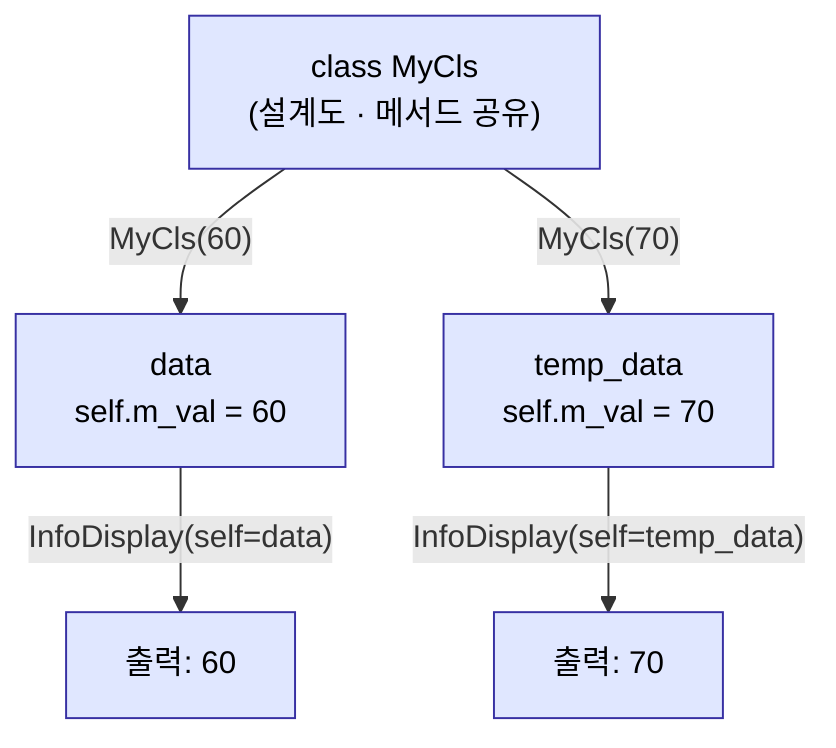
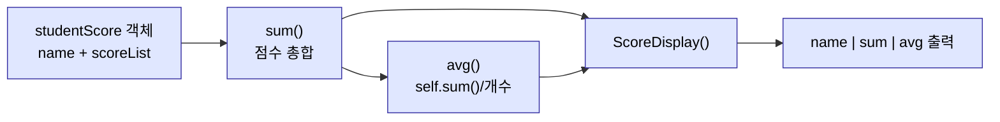

# 2026-05-26 객체지향 프로그래밍(OOP)·클래스 설계 복습 자료

> 수업 필기(`review.py`, `classDesign1.py`, `classDesign_test1.py`, `classDesign_test2.py`, `classDesign_test3.py`, `classDesign_test4.py`, `classDesign_test5.py`)를 주제별로 재구성하고 설명을 덧붙였습니다.

---

## 0. 지난 시간 복습 — 파일 입출력 & 정규식 (`review.py`)

```python
import re

# 파일 다루기
# with open('경로', '접근모드') as f:   # r, w, a, r+
#     f.read()       # 전체를 하나의 문자열로
#     f.readlines()  # 각 라인을 리스트 항목으로
#     f.write()      # 메모리 내용을 파일에 쓰기

# 정규식 = 문자열에서 특정 패턴을 찾고(검색)/치환/분할
strData = "AI 프로그래밍 1998 python Processing!!"
re.findall(r'[가-힣]+', strData)   # ['프로그래밍']
re.findall(r'[0-9]+', strData)     # ['1998']
re.findall(r'[a-zA-Z]')            # ⚠️ 인자 누락 → 에러 (대상 문자열을 줘야 함)
```

- `re.findall(패턴, 대상문자열)` — **인자 2개 필수**. 마지막 줄은 대상 문자열을 빠뜨려 에러.
- 패턴은 항상 raw string `r'...'`.

---

## 1. OOP 큰 그림 — 왜 클래스인가 (`classDesign1.py`)

### 1-1. 구조체 vs 클래스

| 개념 | 담는 것 | 한계/장점 |
|---|---|---|
| **구조체** | 정보(멤버변수)만 | 데이터만 담음. 관련 함수는 흩어져서 따로 관리 |
| **클래스** | 멤버변수 **+** 멤버함수(메서드) | **캡슐화** — 데이터와 데이터를 다루는 코드를 한 그릇에 |

- **OOP(Object Oriented Programming)** = 클래스로 객체를 찍어내 프로그램을 구동.
- 클래스 = 하나의 **사용자 정의 자료형(타입)** 을 설계하는 일. "용도에 맞는 적절한 그릇".
- **상속** — 바퀴를 다시 발명하지 않는다. 부모 클래스를 물려받아 시작.
- 파이썬 **기본 제공 클래스** — `int`, `float`, `bool`, `str`, `list`, `dict`, `tuple`, `set` …

### 1-2. 클래스 정의 & 객체 생성

```python
class MyCls():                # class 키워드. 괄호 안에 부모 클래스(생략 가능)

    def __init__(self, arg):  # 생성자 — 객체 생성 시 자동 호출되는 특수 메서드
        print('__init__ 호출 완료')
        self.m_val = arg      # 멤버변수 등록 + 초기화

    def InfoDisplay(self):    # 퍼블릭 인터페이스 메서드
        print('self.m_val: ', self.m_val)

data = MyCls(60)              # 객체생성문 — 클래스명()
```

- 클래스는 **그릇(설계도)** 일 뿐. 객체를 생성해야 프로그램이 동작한다.
- 모든 특수 메서드는 이름 양옆에 `__` (던더, double underscore).
- **소멸자**는 신경 쓸 필요 없음 — 파이썬은 **가비지 컬렉터**가 자동 회수.

### 1-3. `self` — "누가 호출했는가"

```python
def InfoDisplay(self):        # self = 이 메서드를 호출한 그 객체
    print(self.m_val)
```

- 메서드는 모든 객체가 **공유**하지만, 데이터(`self.m_val`)는 객체마다 **다르다**.
- `self` 가 "어떤 객체가 호출했는지"를 자동 전달 → 그래서 객체별 데이터에 접근 가능.
- `self` 없는 함수는 멤버함수가 아니라 일반 함수.



### 1-4. 자주 하는 실수 모음

```python
print(data.m_val)            # 60 — 외부 직접 접근. ⚠️ 정보 은닉 위배, 지양
print(data.InfoDisplay())    # 'self.m_val: 60' 출력 후 → None 반환(반환값 없음)

listData = [0, 50]
print(listData.sort())       # sort()는 제자리 정렬 후 None 반환 → None 출력

MyCls(80)                    # __init__ 인자가 (self, arg)인데 arg 없으면 에러
MyCls('python programming')  # OK — 파이썬은 동적 타이핑(타입 자유)
```

- **외부 직접 접근(`data.m_val`)** 은 가능하지만 **정보 은닉**을 위해 지양. 가급적 메서드로.
- `print(메서드())` 의 함정: 메서드 **내부 print** 와 메서드 **반환값(None)** 은 별개. 반환값 없는 메서드를 `print()` 로 감싸면 `None` 이 추가로 찍힌다.
- 파이썬은 변수가 가리키는 **객체의 id** 가 넘어가므로 타입 제약이 없다.

---

## 2. 가변 인자 `*args` 로 멤버변수 채우기 (`classDesign_test1.py`)

```python
class MyDataControl():
    def __init__(self, *args):       # *args → 인자들을 튜플로 묶음
        print('객체 생성 완료!')
        self.data = args             # (50, 60, 70, 80, 90)

    def SumOfData(self):
        sum = 0
        for x in self.data:
            sum += x
        print('total: ', self.sum)   # ⚠️ 버그! self.data를 더했는데 self.sum 출력

myData = MyDataControl(50, 60, 70, 80, 90)
myData.SumOfData()
```

- `*args` — 개수가 정해지지 않은 인자를 **튜플**로 수집. `self.data = list(args)` 처럼 변환도 가능.
- ⚠️ **버그 짚기**: 지역변수 `sum` 에 합을 모았는데 출력은 `self.sum`(존재하지 않음) → `AttributeError`. `print('total:', sum)` 으로 고쳐야 함.

---

## 3. 여러 객체를 리스트로 다루기 (`classDesign_test2.py`)

```python
class PersonInfo():
    def __init__(self, *args):
        self.name, self.age, self.region = args   # 튜플 언패킹

    def DisplayInfo(self):
        print('이름: ', self.name, '나이: ', self.age, '지역: ', self.region)

perList = [
    PersonInfo('Hong', 30, 'Seoul'),
    PersonInfo('Kim', 50, 'Daejeon'),
    PersonInfo('Park', 40, 'Busan'),
]
for per in perList:
    per.DisplayInfo()
    print('=' * 80)
```

- `self.name, self.age, self.region = args` — **튜플 언패킹**으로 한 줄에 멤버변수 3개 초기화.
- 객체들을 **리스트에 담아 반복문**으로 일괄 처리 → 객체지향의 전형적 패턴.

---

## 4. 멤버 데이터로 집계하기 (`classDesign_test3.py`)

```python
class MyCalData():
    def __init__(self, arg):
        self.myData = arg

    def AvgDisplay(self):            # __init__ 외 메서드도 모두 self 로 시작
        sum, count = 0, 0
        for i in self.myData:        # i = ('kim', 100) 형태의 튜플
            sum += i[1]              # 점수만 누적
            count += 1
        print('Avg: ', f'{sum/count:.2f}')

data = MyCalData([('kim', 100), ('Park', 90), ('Hong', 70)])
data.AvgDisplay()                    # Avg: 86.67
```

- 질문 "멤버함수는 `__init__` 외에도 다 `self` 로 시작?" → **그렇다**. 인스턴스 메서드는 모두 첫 인자가 `self`.
- `(이름, 점수)` 튜플 리스트에서 `i[1]` 로 점수만 뽑아 평균. `f'{값:.2f}'` 로 소수점 2자리.

---

## 5. 기본 인자값 & Setter 메서드 (`classDesign_test4.py`)

```python
class MyComInfo():
    def __init__(self, arg='Python Academy'):  # 기본 인자값
        self.name = arg

    def DisplayName(self):
        print(self.name)

    def SetName(self, arg):          # Setter — 멤버변수를 메서드로 변경
        self.name = arg

com1 = MyComInfo('AI Academy'); com1.DisplayName()   # AI Academy
com2 = MyComInfo();             com2.DisplayName()   # Python Academy (기본값)
com2.SetName('Agent Academy');  com2.DisplayName()   # Agent Academy
```

- `def __init__(self, arg='기본값')` — 인자 생략 시 **기본값** 사용.
- **Setter 메서드**(`SetName`) 로 값을 바꾸는 것이 외부 직접 접근보다 권장되는 방식(정보 은닉).

---

## 6. 종합 실습 — 클래스 설계 문제 3선 (`classDesign_test5.py`)

### 6-1. 문제 1 — 두 리스트 원소별 합

```python
class MyCalList():
    def __init__(self, *arg):
        self.list1, self.list2 = arg

    def SumOfList(self):
        sumList = [a + b for a, b in zip(self.list1, self.list2)]
        print(sumList)

MyCalList([5, 6, 7], [8, 9, 10]).SumOfList()   # [13, 15, 17]
```

- `zip()` 으로 두 리스트를 짝지어 **원소별 합** → 리스트 컴프리헨션.

### 6-2. 문제 2 — 두 리스트의 차집합

```python
class MyCalList2():
    def __init__(self, *arg):
        self.list1, self.list2 = arg

    def SubOfList(self):
        subList = list(set(self.list1) - set(self.list2))   # 집합 차집합
        print(subList)

MyCalList2([5, 6, 7, 9], [8, 9, 5, 10]).SubOfList()   # [6, 7] (순서 비보장)
```

- `set(A) - set(B)` — **차집합**. 단 집합은 **순서를 보장하지 않음**. 순서가 중요하면 `[a for a in list1 if a not in list2]`.

### 6-3. 문제 3 — 학생별 성적 합/평균 (메서드 간 호출)

```python
class studentScore():
    def __init__(self, name, *arg):  # name은 위치인자, 나머지 점수는 *arg
        self.name = name
        self.scoreList = arg

    def sum(self):
        return sum(self.scoreList)   # 내장 sum() 호출

    def avg(self):
        return self.sum() / len(self.scoreList)   # 자기 메서드 self.sum() 재사용

    def ScoreDisplay(self):
        print(f'\t{self.name}', self.sum(), self.avg(), sep='\t|\t')

StudentList = [
    studentScore('Hong', 80, 60, 70, 90),
    studentScore('Kim',  90, 70, 80, 90),
]
print('\tname', 'sum', 'avg', sep='\t|\t')
for i in StudentList:
    i.ScoreDisplay()
```

- `def __init__(self, name, *arg)` — **고정 인자 + 가변 인자** 혼합. `name` 따로, 점수는 `*arg` 로.
- `avg()` 안에서 `self.sum()` 을 호출 — **메서드가 다른 메서드를 재사용**.
- `print(..., sep='\t|\t')` — 항목 구분자를 지정해 표처럼 정렬 출력.



---

## 7. 오늘의 핵심 한눈에

| 주제 | 핵심 키워드 |
|---|---|
| OOP 개념 | 구조체 vs **클래스(캡슐화)**, 객체=instance, 상속 |
| 클래스 정의 | `class 이름():`, 그릇/설계도일 뿐 |
| 객체 생성 | `변수 = 클래스명(인자)` |
| 생성자 | `__init__(self, ...)` — 생성 시 자동 호출, 던더 메서드 |
| self | "누가 호출했는가" — 객체별 데이터 접근의 열쇠 |
| 멤버변수 | `self.이름 = 값` — 객체가 살아있는 한 유지 |
| 멤버함수 | 첫 인자는 항상 `self` |
| 가변 인자 | `*args` → 튜플로 수집 |
| 튜플 언패킹 | `self.a, self.b = args` |
| 기본 인자값 | `def __init__(self, arg='기본값')` |
| Setter | 메서드로 값 변경 (외부 직접 접근 지양) |
| 정보 은닉 | `data.m_val` 직접 접근은 가능하나 **지양** |
| 메서드 재사용 | `self.다른메서드()` 호출 |
| 반환값 함정 | `print(메서드())` → 내부 출력 + `None` |
| 소멸자 | 불필요 — 가비지 컬렉터 자동 회수 |

> 다음 단계: 상속(`class 자식(부모):`), 메서드 오버라이딩, `super()`, 접근 제어(`_`, `__`), 클래스 변수 vs 인스턴스 변수, `@property`/`@staticmethod`/`@classmethod`.
